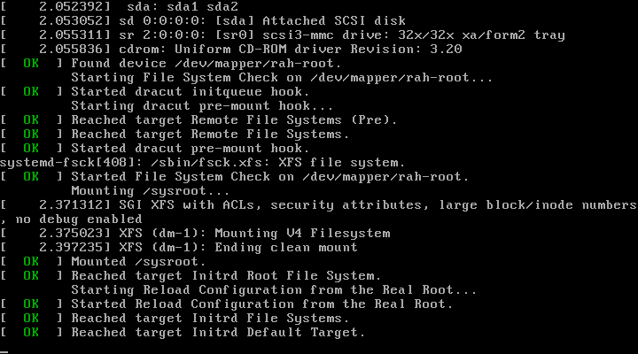
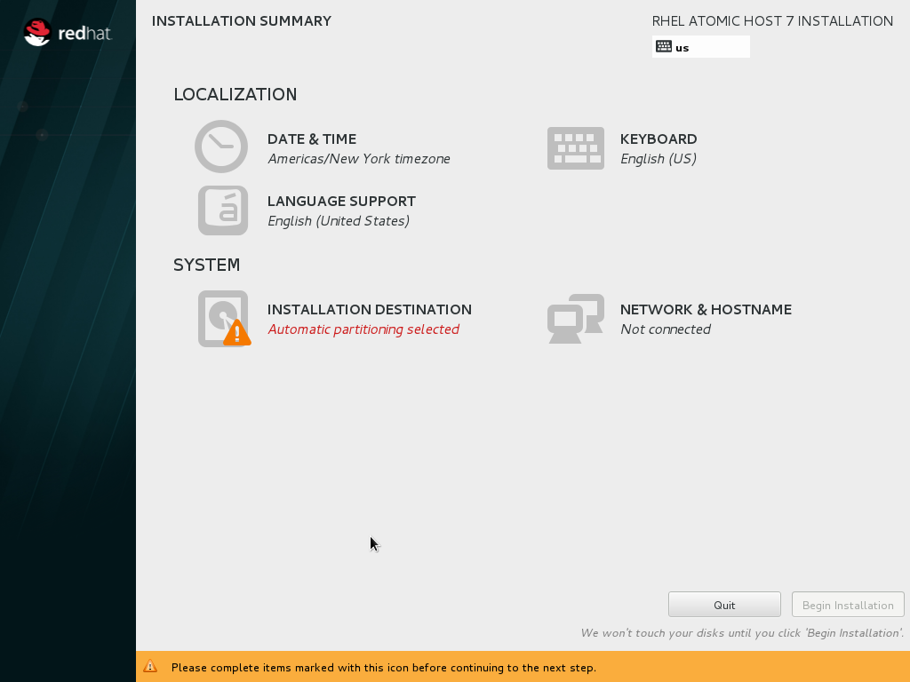
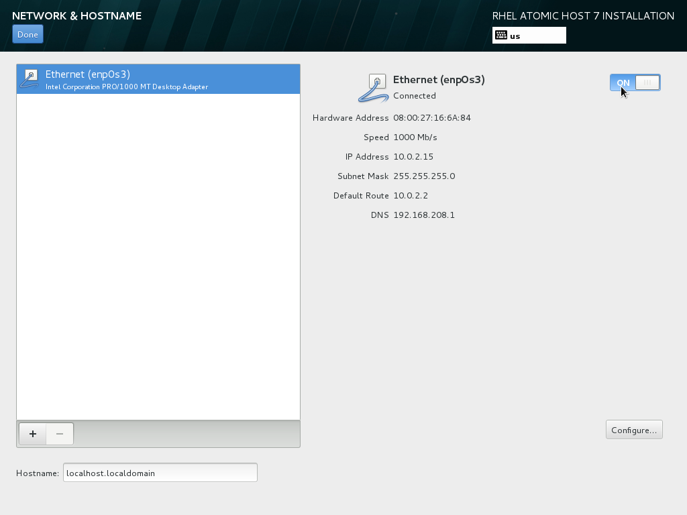
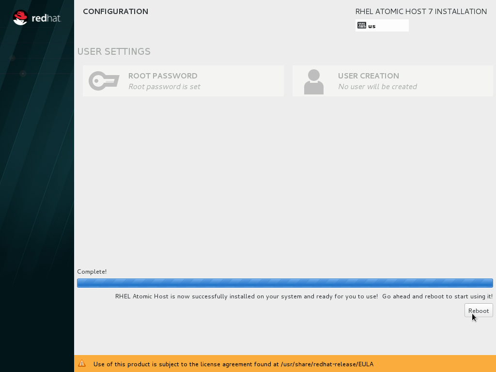

:awestruct-layout: product-get-started
:awestruct-interpolate: true

## Path Intro section
Get started with Red Hat Enterprise Linux Atomic Host for container deployment.

## Prerequisites section title
Introduction and Prerequisites

## Prerequisites section
This tutorial provides an overview of the key steps for obtaining and installing link:http://www.redhat.com/en/technologies/linux-platforms/enterprise-linux[Red Hat Enterprise Linux Atomic Host], which is a secure, minimal-footprint OS optimized to run Linux containers. You will create an Atomic Host installation on a virtual or physical machine using the Atomic Host ISO installer.

You will need a current Red Hat subscription that allows you to download software and updates from Red Hat. If you are interested in purchasing a Red Hat subscription for development, the link:https://www.redhat.com/apps/store/developers/rhel_developer_suite.html[Red Hat Developer Suite] is an affordable choice that includes Red Hat Enterprise Linux Server, Atomic Host, Red Hat Developer Toolset, and Software Collections. For developer support with a guaranteed response time service-level agreement (SLA), Red Hat Developer Workstation Professional or Enterprise subscriptions are available. 

If you don’t have a Red Hat Enterprise Linux subscription, you can try it for free. Get started with an evaluation at link:https://access.redhat.com/products/red-hat-enterprise-linux/evaluation[access.redhat.com/products/red-hat-enterprise-linux/evaluation]. Downloading and installing Atomic Host requires a Red Hat Enterprise Linux Server evaluation. Typically, the recommended evaluation for developers is Red Hat Enterprise Linux Developer Workstation because it includes Red Hat Software Collections and the Red Hat Developer Toolset, however that evaluation does not include Atomic Host. Therefore, you should select an evaluation of Red Hat Enterprise Linux Server.

For the installation, you will need a 64-bit x86 physical or virtual machine with at least 16 GB of available disk space. For more detailed link:https://access.redhat.com/documentation/en-US/Red_Hat_Enterprise_Linux/7/html/Installation_Guide/chap-installation-planning-x86.html[minimum hardware requirements and compatibility information], see the link:https://access.redhat.com/documentation/en-US/Red_Hat_Enterprise_Linux/7/html/Installation_Guide/[Red Hat Enterprise Linux Installation Guide].

Note: This tutorial does not replace the link:https://access.redhat.com/documentation/en-US/Red_Hat_Enterprise_Linux/7/html/Installation_Guide/[Red Hat Enterprise Linux Installation Guide]. Instead, this tutorial provides an overview of the key steps to obtain and install Red Hat Enterprise Linux for software developers. For detailed instructions, see the link:https://access.redhat.com/documentation/en-US/Red_Hat_Enterprise_Linux/7/html/Installation_Guide/[Installation Guide].

### Pre-built Red Hat Enterprise Linux Atomic Host VM Images

Pre-built Atomic Host VM images are available that can be used as an alternative to installing from scratch using the Red Hat Atomic Installer ISO image. Images are provided for many of the popular virtualization platforms as well as a number of cloud service providers. 

Should you choose to use a pre-built VM image, skip the installation section of this tutorial, and continue with the post-install steps.

If you are using Microsoft Windows, Apple Mac OS X, or Fedora Linux, the Red Hat Container Development Kit (CDK) provides pre-built virtual machines (VMs) for both Red Hat Enterprise Linux and the Atomic Host edition. A paid subscription, such as link:https://www.redhat.com/apps/store/developers/rhel_developer_suite.html[Red Hat Developer Suite], is required to download the CDK.
Follow the CDK Installation Guide for your OS:
* link:https://access.redhat.com/articles/1487723[Installing the CDK on Microsoft Windows] +
* link:https://access.redhat.com/articles/1487693[Installing the CDK on Mac OS X] +
* link:https://access.redhat.com/articles/1487733[Installing the CDK on Fedora Linux]

If your system is running Red Hat Enterprise Linux 7, you can run an Atomic Host VM as a KVM guest. See link:https://access.redhat.com/documentation/en-US/Red_Hat_Enterprise_Linux/7/html/Installation_Guide/chap-atomic-virtualization.html#sect-atomic-virtualization-libvirt[Using Red Hat Enterprise Linux Atomic Host in Virtualized Environments]. On the download page, select _Red Hat Atomic Cloud Image_ to download the qcow2 file.

[*FIXME* - NOTE TO REVIEWERS, The above paragraph could be for RHEL, CentOS, and Fedora and the instructions provided should work on all of those.  Probably they would work on other Linux systems with libvirt such as Ubuntu.  Please let me know what you feel it should be.]

The installation guide, link:https://access.redhat.com/documentation/en-US/Red_Hat_Enterprise_Linux/7/html/Installation_Guide/chap-atomic-virtualization.html[Using Red Hat Enterprise Linux Atomic Host in Virtualized Environments] also covers:
* Red Hat Enterprise Virtualizatoin (RHEV)
* Red Hat Enterprise Linux OpenStack Platform
* VMware
* Microsoft Hyper-V
* Amazon Web Services (AWS)
* Google Compute Engine (GCE)

Note: The pre-built Atomic VM images do not have a default username and password, the cloud-init tool is used to create them. You will need to create a separate ISO file containing your login credentials to use with cloud-init.

If you encounter difficulties at any point in this tutorial, see <<troubleshooting,Troubleshooting and FAQ>>.

## Step1 Duration
10-20 minutes (verify?)

## Step1 Title
Obtain Red Hat Enterprise Linux Atomic Host

## Step2 Duration
30-60 minutes (verify?)

## Step2 Title
Install Red Hat Enterprise Linux Atomic Host

## Step3 Duration
10 minutes (verify?)

## Step3 Title
Getting your system ready

## Step1 Content

In this step, you will download Red Hat Enterprise Linux Atomic Host from the Red Hat customer portal, link:https://access.redhat.com/[access.redhat.com]. The steps are:

. Log in to link:https://access.redhat.com/[access.redhat.com].
+
If you don't have an account, link:https://www.redhat.com/wapps/ugc/register.html[register to create one].
. Obtain a link:https://access.redhat.com/products/Red_Hat_Enterprise_Linux/Developer/#dev-page=1[Red Hat Enterprise Linux subscription] if you don't already have one:
+
* Purchase a developer's subscription: https://www.redhat.com/apps/store/developers/rhel_developer_suite.html[Developer Suite] or https://www.redhat.com/apps/store/developers/rhel_developer_workstation_professional.html[Developer Workstation].
+
* Or, start a link:https://access.redhat.com/products/red-hat-enterprise-linux/evaluation[Red Hat Enterprise Linux Server evaluation].
.. After you sign up for the evaluation you will receive an email with a link to click on to activate your 30-day evaluation.

. Download the link:https://access.redhat.com/downloads/content/271/ver=/rhel---7/7.1.1/x86_64/product-downloads[Red Hat Atomic Installer ISO file].
+
On the download page, under _Product Variant_ select _Red Hat Enterprise Linux Atomic Host_. You may need to scroll down to locate the Atomic Host choice.
+
Under _Version_ select the latest released (non-beta) version of Red Hat Enterprise Linux 7. Note: Minor releases such as 7.1.4, might not included an updated Atomic Host Installer ISO image, you may need to a previous major release such as 7.1.0.
+
The _Architecture_ selection should be set to _x86_64_.
+
Click the _Download Now_ button for _Red Hat Atomic Installer_. 

Instructions for making a bootable https://access.redhat.com/documentation/en-US/Red_Hat_Enterprise_Linux/7/html/Installation_Guide/chap-making-media.html#sect-making-cd-dvd-media[DVD] or https://access.redhat.com/documentation/en-US/Red_Hat_Enterprise_Linux/7/html/Installation_Guide/sect-making-usb-media.html[USB] drive can be found in the link:https://access.redhat.com/documentation/en-US/Red_Hat_Enterprise_Linux/7/html/Installation_Guide/chap-making-media.html[Red Hat Enterprise Linux Installation Guide].

If you encounter difficulties at any point, see <<troubleshooting,Troubleshooting and FAQ>>.

## Step2 Content
This section provides a brief overview of the steps for installing Red Hat Enterprise Linux Host. Detailed instructions can be found in the link:https://access.redhat.com/documentation/en-US/Red_Hat_Enterprise_Linux/7/html/Installation_Guide/[Red Hat Enterprise Linux Installation Guide].

There are a few key steps to remember during the installation process:

. You will need to select an _Installation destination_, which is the disk or partition(s) where the software will be installed. *The disk or partition(s) you select will be overwritten.* Make sure you understand your selection before starting the installation to avoid accidental data loss.
. You should configure networking under _Network and host name_ before starting the installation. You will need access to the Internet to complete registration and download containers. The network can be configured after the system is installed. However, the steps are more straightforward during installation.


### Installation instructions

. Start the system from the bootable disk and select _Install Red Hat Enterprise Linux_.
+
// image:#{cdn(site.base_url + '/images/products/xxx/atomic-install/install-1-first-boot.png')}[Screenshot Boot Splash]

+
. Select your preferred language and keyboard layout to use during installation.
. Under _Localization_ review the settings and make any necessary changes for date and time, language, and keyboard layout. Note: The _Done_ button to return to the _Installation summary_ screen is located in the upper left corner of the screen.
+
// image:#{cdn(site.base_url + '/images/products/xxx/atomic-install/image-3-install-options-first.png')}[Screenshot Installation Options]

+
. Click _Installation destination_ to specify which disk or partition(s) to install the software on. Note: It is important that you understand the choices that you are making in this section to avoid accidental data loss. It is strongly recommended that you read the link:https://access.redhat.com/documentation/en-US/Red_Hat_Enterprise_Linux/7/html/Installation_Guide/sect-disk-partitioning-setup-x86.html[Installation Destination] section of the the link:https://access.redhat.com/documentation/en-US/Red_Hat_Enterprise_Linux/7/html/Installation_Guide/[Red Hat Enterprise Linux Installation Guide]. The installation destination should be at least 16 GB or larger to accommodate the OS, graphical desktop, and development tools.
+
. Click _Network & host name_ to configure the network. If the system has more than one network adapter, select it from the list on the left. Then click the _On/Off_ button on the right to enable the network adapter. Click _Configure_ to review and/or change the default settings for the network adapter. Optionally, set a _Host name_ for the system. Before leaving this screen, make sure there is at least one network adapter enabled with the switch in the _On_ position. A network connection will be required to register the system and download system updates.
+
// image:#{cdn(site.base_url + '/images/products/xxx/atomic-install/image-6-network.png')}[Screenshot Network Configuration]

+
. Click the _Begin installation_ button when you are ready to start the actual installation.
. On the next screen, while the installation is running, you may optionally click _User creation_ to create a non-root user ID.
+
. Click _Root password_ to set the password for the root user. Note: If you choose a password that the system considers to be weak, you will need to click _Done_ twice.
. After the installation process completes, click the _Reboot_ button.
+
// image:#{cdn(site.base_url + '/images/products/xxx/atomic-install/install-7-complete.png')}[Screenshot Installation Complete]



If you need help, see <<troubleshooting,Troubleshooting and FAQ>>.


## Step3 Content

This section provides an overview of post-installation steps that prepare your system for running containers.

. After the system reboots, accept the license agreement.
+
// image:#{cdn(site.base_url + '/images/products/xxx/atomic-install/image-10-first-boot-license.png')}[Screenshot Installation Complete]
image:images/atomic-install/image-10-first-boot-license.png[Screenshot Installation Complete]
+
. Click _Finish configuration_.
. On the _Subscription Management Registration_ screen;
.. if you need to configure an HTTP proxy server, click _Configure Proxy_
.. Click _Done_ to move the next screen.
// image:#{cdn(site.base_url + '/images/products/xxx/atomic-install/image-11-a-registration-next.png')}[Screenshot Installation Complete]
image:images/atomic-install/image-11-a-registration-next.png[Screenshot Installation Complete]
. Register your system with Red Hat. Use the same username and password that you created for the Red Hat Customer Portal. 
+
Note: For this step to succeed, you must have configured a network connection during boot.
+
If you are using an evaluation, you must first agree to the terms and conditions at link:https://www.redhat.com/wapps/ugc/[www.redhat.com/wapps/ugc/].
+
*NOTE TO REVIEWERS: There may be a bug here, or a recent problem with the customer portal. I can't register the system with an eval, due to the agreement. I've tried visiting that link from another system, that still won't get me past the first-boot registration page.  There may be a bug that prevents registration at first boot. Lately I'm getting a Java error returned which I think is from the portal.*
+
. Log in to the system with the username and password you created during installation.
+
If you didn't create a regular user, you will need to log in as root and create a user. See <<troubleshooting,Troubleshooting and FAQ>>.
+
If you get a text-based login screen instead of a graphical one, see <<troubleshooting,Troubleshooting and FAQ>>.
+
. Select your preferred language.


### Install the latest updates

In this step, you will download and install the latest updates for your system from Red Hat. In the process, you will verify that your system has a current Red Hat subscription and is able to receive updates.

First, start a _Terminal_ window from the _Application_ menu.  Then, after using `su` to change to the root user ID, use `subscription-manager` to verify that you have access to Red Hat software repositories. 

[.code-block]
```
$ su -
# subscription-manager repos --list-enabled
```

If you don’t see any enabled repositories, your system might not be registered with Red Hat or might not have a valid subscription. See <<troubleshooting,Troubleshooting and FAQ>> for more information.

Now download and install any available updates by running `yum update`.  If updates are available, `yum` will list them and ask if it is OK to proceed.

`# yum update`

### Enable additional software repositories

In this step you will configure your system to obtain software from the RHSCL software repository. The RHSCL repository includes the both the RHSCL software collections as well as DTS (the Red Hat Developer Toolset). RHSCL includes the latest stable versions of dynamic languages, open source databases, and web development tools that can be deployed alongside those included in Red Hat Enterprise Linux. DTS provides the latest, stable, open source C and {cpp} compilers and complementary development tools, including Eclipse.  

Instructions are provided for both the command line (CLI) and graphical user interface (GUI).

#### Using the Red Hat Subscription Manager GUI

Red Hat Subscription Manager can be started from the _System Tools_ group of the _Applications_ menu. Alternatively, you can start it from the command prompt by typing `subscription-manager-gui`. +

. On the Subscription Manager _System_ menu, select _Repositories_.
. In the list of repositories, check the _Enabled_ column for _rhel-server-rhscl-7-rpms_ and _rhel-7-server-optional-rpms_. Note: After clicking, it might take several seconds for the check mark to appear in the _Enabled_ column. +
 
If you don’t see any RHSCL repositories in the list, your subscription might not include it.
[.content-img]
image:#{cdn(site.base_url + '/images/products/softwarecollections/softwarecollections_install_1.png')}[Manage Repositories]

See <<troubleshooting,Troubleshooting and FAQ>> for more information. +


#### Using subscription-manager from the command line

You can add or remove software repositories from the command line using the `subscription-manager` tool as the root user. Use the `--list` option to view the available software repositories and verify that you have access to RHSCL, which includes DTS:

[.code-block]
```
$ su -
# subscription-manager repos --list | egrep rhscl
```

If you don’t see any RHSCL repositories in the list, your subscription might not include it. See <<troubleshooting,Troubleshooting and FAQ>> for more information.

[.code-block]
```
# subscription-manager repos --enable rhel-server-rhscl-7-rpms
# subscription-manager repos --enable rhel-7-server-optional-rpms
```


### Where to go next?

*Developing with Red Hat Enterprise Linux* +
link:https://access.redhat.com/documentation/en-US/Red_Hat_Enterprise_Linux/7/html/Developer_Guide/index.html[Red Hat Enterprise Linux 7 Developer Guide] -- The developer guide for Red Hat Enterprise Linux 7 provides an introduction to application development tools and using source code management tools, such as Git, in Red Hat Enterprise Linux 7.

*Learn about Red Hat Software Collections*

link:https://access.redhat.com/products/Red_Hat_Enterprise_Linux/Developer/#dev-page=5[Red Hat Software Collections] deliver the latest stable versions of dynamic languages, open source databases, and web development tools that can be deployed alongside those included in Red Hat Enterprise Linux. Red Hat Software Collections is available with select Red Hat Enterprise Linux subscriptions and has a three-year life cycle to allow rapid innovation without sacrificing stability.

*Learn about the Red Hat Developer Toolset*

Red Hat Developer Toolset provides the latest, stable, open source C and {cpp} compilers and complementary development tools including Eclipse. DTS enables developers to compile applications once and deploy across multiple versions of Red Hat Enterprise Linux.

*FIXME, TODO ADD LINKS to the RHEL 7 native language, DTS, and SCL Getting Started Guides*


## More Resources

### Become a Red Hat developer: developers.redhat.com

Red Hat delivers the resources and ecosystem of experts to help you be more productive and build great solutions.  Register for free at link:http://developers.redhat.com/[developers.redhat.com].

*Follow the Red Hat Developer Blog* +
link:http://developerblog.redhat.com/[]


## Faq section title
[[troubleshooting]]Troubleshooting and FAQ

## Faq section
. My system is unable to download updates from Red Hat.
+
Your system must be registered with Red Hat using `subscription-manager register`. You need to have a current Red Hat subscription or an evaluation.
. I don't have a current Red Hat subscription, can I get an evaluation?
+
If you don’t have a Red Hat Enterprise Linux subscription, you can try it for free. Get started with an evaluation at link:https://access.redhat.com/products/red-hat-enterprise-linux/evaluation[access.redhat.com/products/red-hat-enterprise-linux/evaluation]. Downloading and installing Atomic Host requires a Red Hat Enterprise Linux Server evaluation. Typically, the recommended evaluation for developers is Red Hat Enterprise Linux Developer Workstation because it includes Red Hat Software Collections and the Red Hat Developer Toolset, however that evaluation does not include Atomic Host. Therefore, you should select an evaluation of Red Hat Enterprise Linux Server.
+
. I can't find the Red Hat Atomic Installer ISO file.
+
On the Red Hat Enterprise Linux download page, under _Product Variant_ select, Red Hat Enterprise Linux Atomic Host_.  You may need to scroll down to find it.
+
Some minor releases, e.g. 7.1.4, may not include an updated Atomic Installer ISO file. Under _Product Version_ select the most recent major release, such as 7.1.0, or 7.0.
+
. Under _Product Variant_ I don't have an option for Red Hat Enterprise Linux Atomic Host.
+
You must have a subscription for Red Hat Enterprise Linux Server, or a paid Developer Workstation subscription for access to Red Hat Enterprise Linux Atomic Host. You can also download Atomic Host by starting a Red Hat Enterprise Linux Server evaluation.
+
. How do I install the C/{cpp} compiler or other software development tools on Atomic Host?
+
Why can't I install software on Atomic Host using yum, rpm, or package manager?
+
*FIXME* 
+
. I didn't configure a network connection during installation, how do I this on a running system?
+
If you did not configure a network connection during installation or the configuration was unsuccessful, see the instructions in link:https://access.redhat.com/articles/rhel-atomic-getting-started[Getting Started with Red Hat Atomic Host].

. How do I register my system after installation?
+
Use Red Hat Subscription Manager, which can be started from the system menu as a graphical tool, or from the command line using the following command:
+
`# subscription-manager register --auto-attach`
+
For more information see link:https://access.redhat.com/solutions/253273[How to register and subscribe a system to the Red Hat Customer Portal using Red Hat Subscription Manager].

. What's the username and paswsword for the pre-built VM images?
+
The pre-built Atomic VM images do not have a default username and password, the cloud-init tool is used to create them. You will need to create a separate ISO file containing your login credentials to use with cloud-init. See link:https://access.redhat.com/documentation/en-US/Red_Hat_Enterprise_Linux/7/html/Installation_Guide/chap-atomic-virtualization.html[Using Red Hat Enterprise Linux Atomic Host in Virtualized Environments].
. Can I run and build docker containers on Red Hat Enterprise Linux?
+
Red Hat Enterprise Linux includes docker, but it is not installed by default. See link:https://access.redhat.com/articles/881893#get[Getting Docker on RHEL 7] in the article link:https://access.redhat.com/articles/881893[Get Started with Docker Formatted Container Images on Red Hat Systems].
. Where can I learn more about delivering applications with Linux containers?
+
If you haven't already joined the link:http://developers.redhat.com/[Red Hat Developers program], sign up at link:http://developers.redhat.com/[developers.redhat.com]. Membership is free.+
link:https://access.redhat.com/articles/1483053[Recommended Practices for Container Development] and many other container articles are available from the link:https://access.redhat.com/[Red Hat Customer Portal].+
If you are a Red Hat Technology Partner, visit the link:https://access.redhat.com/articles/1483053[Container Zone] at the link:http://connect.redhat.com/[Red Hat Connect for Technology Partners] web site.
. When I start Atomic Host, I don't see a graphical environment.
+
Atomic Host is specifically optimized for deploying of Linux containers in environments like Infrastructure as a Service (IaaS) clouds. Atomic Host's minimal footprint contains only the software needed to efficiently host containers. Since it does not include a graphical user interface or development tools, Atomic Host isn't well suited for software development activities. Instead, developers should use Red Hat Enterprise Linux, which is design to suit many purposes including desktop and server installations. See link:https://access.redhat.com/articles/881893[Get Started with Docker Formatted Container Images on Red Hat Systems]. After an application is developed and packaged in a container, developers can test them on Atomic Host to ensure it is ready for deployment. Atomic Host can be helpful for developers who are creating continuous integration/continuous delivery (CI/CD) environments.


