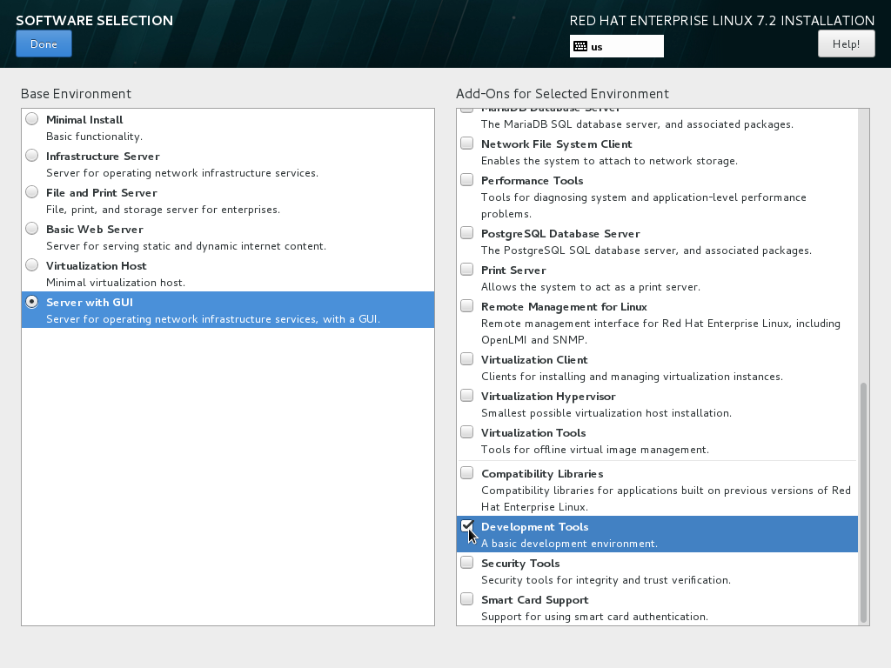
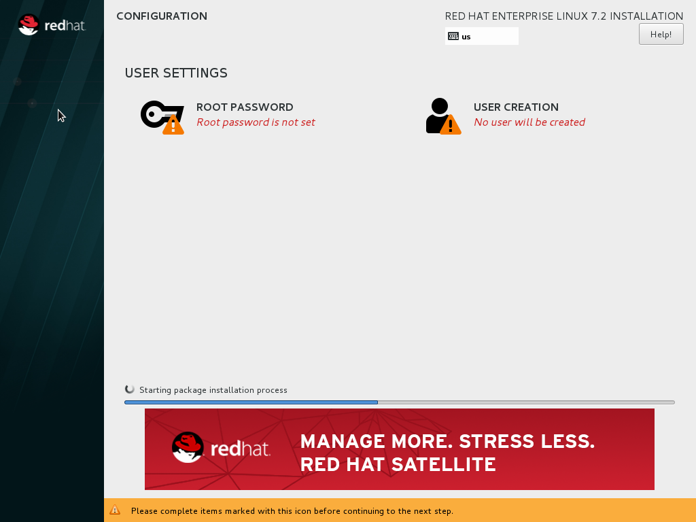

:awestruct-layout: product-get-started
:awestruct-interpolate: true

## Path Intro section
Developer quick start: Install Red Hat Enterprise Linux 7 in a VirtualBox VM

## Prerequisites section title
Introduction and Prerequisites

## Prerequisites section
This tutorial provides an overview of the key steps for installing link:http://developers.redhat.com/products/rhel/overview/[Red Hat Enterprise Linux] in a link:https://www.virtualbox.org/[VirtualBox] Virtual Machine (VM) so you can get started with software development. The VM you create will give you a Red Hat Enterprise Linux development environment that you can use on your system running Microsoft Windows, Mac OS X, Ubuntu, or other Linux.

If you don’t have a Red Hat Enterprise Linux subscription, get link:https://developers.redhat.com/products/rhel/download/[Red Hat Enterprise Developer Suite] after registering at link:https://developers.redhat.com/[developers.redhat.com]. Red Hat Enterprise Linux Developer Suite includes Red Hat Enterprise Linux Server, link:http://developers.redhat.com/products/softwarecollections/overview/[Red Hat Software Collections (RHSCL)] and link:http://developers.redhat.com/products/developertoolset/overview/[Red Hat Developer Toolset (DTS)].


Note: This tutorial does not replace the link:https://access.redhat.com/documentation/en-US/Red_Hat_Enterprise_Linux/7/html/Installation_Guide/[Red Hat Enterprise Linux Installation Guide] or link:https://www.virtualbox.org/manual/UserManual.html[VirtualBox User Manual]. Instead, this tutorial provides an overview of the key steps for software developers. For detailed instructions, see the respective manaul.

### Overview of steps

. Download and install VirtualBox.
. Download Red Hat Enterprise Linux Server DVD ISO file.
. Create a VM and install Red Hat Enterprise Linux.
. Customize your Red Hat Enterprise Linux VM for software development.

A few things to keep in mind:

* You will be using the Server edition of Red Hat Enterprise Linux. This provides you with the widest range of software to develop and test with.
* The VM will have a full graphical desktop. You will select _Server with a GUI_ during installation.
* After installation, you will configure additional software repositories that will provide you access to optional development software such as RHSCL and DTS.

### System Requirements

The requirements for your physical system that will host the Red Hat Enterprise Linux VM are:

* a 64-bit x86 machine with hardware virtualization assistance (Intel VT-X or AMD-V).
* An link:https://www.virtualbox.org/manual/ch01.html#hostossupport[operating system supported by VirtualBox] such as Microsoft Windows 7 or later, Apple Mac OS X 10.8 or later, Ubuntu Linux 12.04 or later.
* 4 GB RAM (8 GB preferred).
* 24 GB of available disk space for the VM, the installation ISO file, and VirtualBox.
* A processor with hardware virtualization assistance (Intel VT-x or AMD-V).


// For the installation, you will need a 64-bit x86 physical or virtual machine with at least 16 GB of available disk space. For more detailed link:https://access.redhat.com/documentation/en-US/Red_Hat_Enterprise_Linux/7/html/Installation_Guide/chap-installation-planning-x86.html[minimum hardware requirements and compatibility information], see the link:https://access.redhat.com/documentation/en-US/Red_Hat_Enterprise_Linux/7/html/Installation_Guide/[Red Hat Enterprise Linux Installation Guide].


If you encounter difficulties at any point in this tutorial, see <<troubleshooting,Troubleshooting and FAQ>>.

// Test: Can I leave out the duration?
// ## Step1 Duration
// 10-30 minutes

## Step1 Title
Prepare your system

// Test: Can I leave out the duration?
// ## Step2 Duration
// 30-60 minutes

## Step2 Title
Install Red Hat Enterprise Linux

// Test: Can I leave out the duration?
// ## Step3 Duration
// 10 minutes

## Step3 Title
Getting ready for software development

## Step1 Content

In this step you will:

. Download and install VirtualBox.
. Download Red Hat Enterprise Linux.
. Create and configure a new VM.

### Download and install VirtualBox

This guide uses VirtualBox is 5.0.x. You may also use VirtualBox 4.3.x though there will be some minor differences from what is described here. Older versions of VirtualBox may work but have not been tested.

#### Microsoft Windows or Apple Mac OS X

Go to the link:https://www.virtualbox.org/wiki/Downloads[VirtualBox Download page] and download the installer for your system. After the download completes, click on the downloaded `.exe` or `.dmg` file to start the installation. During the installation you will need to agree to using administrative privileges for a number of the steps.

#### Ubuntu Linux and other Linux systems

Ubuntu Linux and other Linux distributions includes packages for VirtualBox that you can install using your regular package management commands. On Ubuntu Linux use the following command:

`$ sudo apt-get install virtualbox`

If your distribution doesn’t include VirtualBox packages or the packages are older than VirtualBox 4.3.x, see the VirtualBox for Linux download page to download a package for your system.

#### Optional step: Install VirtualBox Extension Pack

A extension package is available for VirtualBox that provides support for USB devices, remote desktop access via RDP, and PXE boot. The software is provided in binary form as it is not open-source. The extension package is available on the link:https://www.virtualbox.org/wiki/Downloads[VirtualBox Download page]. 

#### Enable Intel VT-x or AMD-V Virtualizatoin in BIOS/UEFI

Intel and AMD processors have hardware extensions for accelerating virtualization. On some systems this support may be disabled by default in the system’s BIOS/UEFI.  To enable the extensions, you might have to go into the system’s BIOS/UEFI setup configuration at boot time. Consult your system’s hardware documentation for more information.

#### Disable Microsoft Hyper-V to avoid conflicts with VirtualBox

On some Microsoft Windows systems it may be necessary to disable Microsoft Hyper-V virtualization in order to use VirtualBox. Only one virtualization platform, or hypervisor, can be active on a host system at a time. While hypervisors like VirtualBox only take control of the host system’s hardware virtualization capabilities when they are actually running a VM, Microsoft Hyper-V takes control at boot time. In order to use VirtualBox, Hyper-V must either be disabled or uninstalled. Consult Microsoft’s  documentation for more information. Note: if you are interested in using Microsoft Hyper-V instead of VirtualBox, check the link:http://developers.redhat.com/[Red Hat Developers site] for more information. 

#### Download Red Hat Enterprise Linux Server ISO file

In this step, you will download Red Hat Enterprise Linux from the Red Hat customer portal, link:https://access.redhat.com/[access.redhat.com]. The steps are:

. Log in to link:https://access.redhat.com/[access.redhat.com].
+
If you don't have an account, link:https://www.redhat.com/wapps/ugc/register.html[register to create one].
+
. Download the _binary DVD .iso file_ for link:https://access.redhat.com/downloads/content/69/ver=/rhel---7/x86_64/product-downloads[Red Hat Enterprise Linux Server].
+
On the download page, under _Product Variant_ select _Red Hat Enterprise Linux Server_. Choosing the _Server_ edition gives you the widest range of software to develop and test with. During installation you will choose the _Server with a GUI_ option for a full graphical desktop.
+
Under _Version_ select the latest released (non-beta) version of Red Hat Enterprise Linux 7. The _Architecture_ selection should be set to _x86_64_.
+
Click the _Download Now_ button for _Binary DVD_ installer. The file size should be between 3 and 4 GBs. Do not select the much smaller _Boot ISO_ as it doesn't contain the installation software.

#### Create and configure a VM in VirtualBox

In this step you will create and configure the VM that will run Red Hat Enterprise Linux. The system you are running VirtualBox on is called the _host system_. Note: VirtualBox refers to the VM running Red Hat Enterprise Linux as the _guest system_. However, most of the options to control the VM are under the _Machine_ menu entry.

First, launch VirtualBox from your system’s menu. On some systems, the menu entry will be called _Oracle VM VirtualBox_.

Before you create any VMs, you may wish to change where VirtualBox stores the files that are used as virtual hard disks for the VMs you create. By default, VirtualBox places these files in your home directory. You will need at least 16 GB of available space. To change the location, select _Preferences_ from the _File_ menu. Under _General_, change _Default Machine Folder_ to your preferred location.

Click the _New_ button to create a new VM. A series of dialog boxes will come up for you to configure the VM:

. On the _Create Virtual Machine_ dialog:
.. Enter _RHEL_ as the name or part of the name. This will be the name of the created VM in VirtualBox. Including _RHEL_ will automatically set VM  _Type_ and _Version_.
.. Ensure that _Type_ is set to _Linux_ and _Version_ is set to _Red Hat (64-bit)_.
.. Click _Next_.
+
// image:#{cdn(site.base_url + '/images/products/rhel/rhel7-install/vbox/ubuntu-vbox-02-create.png')}[Screenshot Boot Splash]

+
. Set the VM memory size ro _4096 MB_ on the _Memory size_ dialog. This value can be changed later. Then, cloick _Next_.


Next you will configure the new VM's virtual hard disk. The size of the virtual hard disk, should be a minimum of 16 GB. While this setting can be changed later, it is a multi-step process not covered by this guide. Therefore it is recommended that you size the virtual hard disk to be large enough for your software development activities. Note: The space on your host system's physical disk will not be allocated until it is used by the VM. Complete the next set of dialogs to configure the virtual hard disk:

. Select _Create a virtual hard disk now_ on the _Hard disk_ dialog. Then, click _Create_ to move to the next dialog.
. Select _VDI (VirtualBox Disk Image)_ on the _Hard disk file type_ dialog. Then, click _Next_.
. Select _Dynamically allocated_ on the _Storage on physical hard disk_ dialog. Then, click _Next_.
// image:#{cdn(site.base_url + '/images/products/rhel/rhel7-install/vbox/ubuntu-vbox-05-hd4.png')}[Screenshot HD Dynamic]

. On the _File location and size+ dialog:
.. Change the _name_ and _location_ if desired.
.. Set the _size_ to be a minimum of _16 GB_.
.. Click _Create_.
// image:#{cdn(site.base_url + '/images/products/rhel/rhel7-install/vbox/ubuntu-vbox-05-hd2.png')}[Screenshot File Location]


At this point the basic VM configuration has been completed, however additional configuration is necessary. Click to select the new VM so that it is highlighted, then click the Settings button. Make the following changes:
// image:#{cdn(site.base_url + '/images/products/rhel/rhel7-install/vbox/ubuntu-vbox-06-settings1.png')}[Screenshot VM Created]
image::images/rhel7-install/vbox/ubuntu-vbox-06-settings1.png[Screenshot VM Created]

. Select the _General_ group, then click the _Advanced_ tab. Enable copy-and-paste between the host system and the VM by setting _Shared Clipboard_ and _Drag’n’Drop_ to _Bidirectional_.
+
// image:#{cdn(site.base_url + '/images/products/rhel/rhel7-install/vbox/ubuntu-vbox-06-settings2.png')}[Screenshot Settings Advanced]
image::images/rhel7-install/vbox/ubuntu-vbox-06-settings1.png[Screenshot Settings Advanced]
+
. By default, the VM will have a single virtual processor. If your system has multiple processors or cores, you can add more. Select the _System_ group, then click the _Processor_ tab. Adjust _Processors_ to the desired value.
+
// image:#{cdn(site.base_url + '/images/products/rhel/rhel7-install/vbox/ubuntu-vbox-06-settings3.png')}[Screenshot Settings Processor]

+
. In the _Network_ group, under the _Adapter 1_ tab, you can configure the VM’s networking configuration. See _VirtualBox Networking_ below for more information.

Next, configure the VM to use the Red Hat Enterprise Linux Server binary DVD ISO file as a virtual CD/DVD:

. Select the _Storage_ section of the _VM Settings_ dialog.
. Under _Controller: IDE_, select the CD icon that says _Empty_ next to it.
. On the right side, under _Attributes_, click the CD icon on the far right. 
. Select _Choose Virtual Optical Disk File_.
. Navigate to the Red Hat Enterprise Linux Server binary DVD ISO file that you downloaded earlier.
. Click _OK_ to close the VM settings dialog.

// image:#{cdn(site.base_url + '/images/products/rhel/rhel7-install/vbox/ubuntu-vbox-04-settings4.png')}[Screenshot Settings RHEL DVD]


#### Create a shared folder between the host system and the VM (Optional)

You may create a folder that is shared between your host system and the Red Hat Enterprise Linux VM. This makes it easy to share files such as source code between the two systems. The configuration for shared folders can be performed now or anytime later.

Shared folders will only be available on the VM after the _VirtualBox Guest Additions_ software is installed on the VM. Installation of VirtualBox Guest Additions is covered later with the other Red Hat Enterprise Linux post-installation steps.

To add a shared folder:

. Select your _RHEL VM_ in VirtualBox, the click the _Settings_ button.
. Select the _Shared Folders_ group.
. Click the folder icon with a _+_ in the upper right corner.
. In the _Add Share_ dialog:
.. Enter the path on the host system in the _Folder Path_.
.. Ehter a name without spaces for the shared folder on the VM.
. Click _OK_ to close the _VM Settings_ dialog.


If you encounter difficulties at any point, see <<troubleshooting,Troubleshooting and FAQ>>.

## Step2 Content

In this step you will boot the VM and install Red Hat Enterprise Linux. To start the VM and begin installation, start VirtualBox if it isn’t already running, then select your VM and click the Start button. The VM should now boot up from the Red Hat Enterprise Linux Server DVD.

This section provides a brief overview of the steps for installing Red Hat Enterprise Linux. Detailed instructions can be found in the link:https://access.redhat.com/documentation/en-US/Red_Hat_Enterprise_Linux/7/html/Installation_Guide/[Red Hat Enterprise Linux Installation Guide].

There are a few key steps to remember during the installation process:

. The _Installation destination_ will be the virtual hard disk you created for the VM.
. You should configure networking under _Network and host name_ before starting the installation. You will need access to the Internet to complete registration and download additional software. The network can be configured after the system is installed. However, the steps are more straightforward during installation.
. Select _Server with a GUI_ under _Software Selection_ so the system will boot into the full graphical environment after installation. By default, Red Hat Enterprise Linux Server will not install a graphical desktop.
. Create your primary user account during installation: After the installation begins, you will be instructed to set a password for the root account and be given the opportunity to create a regular user account. You should create a user before the installation process completes. The regular user will be your primary login for development. The root account should only be used for system administration tasks. If you don't create a user before the installation completes, you will need to reboot and then log in as root to create user accounts.

### Installation instructions

. Start the system from the bootable disk and select _Install Red Hat Enterprise Linux_.
+
// image:#{cdn(site.base_url + '/images/products/xxx/rhel7-install/rhel-72/rhel-01-boot-dvd.png')}[Screenshot Boot Splash]
image::images/rhel7-install/rhel-72/rhel-01-boot-dvd.png[Screenshot Boot Splash]
+
. Select your preferred language and keyboard layout to use during installation.
. Under _Localization_ review the settings and make any necessary changes for date and time, language, and keyboard layout. Note: The _Done_ button to return to the _Installation summary_ screen is located in the upper left corner of the screen.
+
// image:#{cdn(site.base_url + '/images/products/xxx/rhel7-install/rhel-72/rhel-03-install-options-first.png')}[Screenshot Installation Options]
image::images/rhel7-install/rhel-72/rhel-03-install-options-first.png[Screenshot Installation Options]
+
. Perform the follow steps to make your software selection:
.. Click _Software selection_.
.. On the next screen, under _Software selection_, in the _Base environment_ list on the left, select _Server with GUI_.
.. In the list _Add-ons for selected environment_ on the right, select _Development tools_.
.. Click the _Done_ button. Note: After returning to the _Installation summary_ screen it will take several seconds to validate your choices.
+
// image:#{cdn(site.base_url + '/images/products/xxx/rhel7-install/rhel-72/rhel-04-software-selection.png')}[Screenshot Software Selection]

+
. Click _Installation destination_ to specify which disk or partition(s) to install the software on. Note: It is important that you understand the choices that you are making in this section to avoid accidental data loss. It is strongly recommended that you read the link:https://access.redhat.com/documentation/en-US/Red_Hat_Enterprise_Linux/7/html/Installation_Guide/sect-disk-partitioning-setup-x86.html[Installation Destination] section of the the link:https://access.redhat.com/documentation/en-US/Red_Hat_Enterprise_Linux/7/html/Installation_Guide/[Red Hat Enterprise Linux Installation Guide]. The installation destination should be at least 16 GB or larger to accommodate the OS, graphical desktop, and development tools.
+
. Click _Network & host name_ to configure the network. If the system has more than one network adapter, select it from the list on the left. Then click the _On/Off_ button on the right to enable the network adapter. Click _Configure_ to review and/or change the default settings for the network adapter. Optionally, set a _Host name_ for the system. Before leaving this screen, make sure there is at least one network adapter enabled with the switch in the _On_ position. A network connection will be required to register the system and download system updates.
+
// image:#{cdn(site.base_url + '/images/products/xxx/rhel7-install/rhel-72/rhel-07-network.png')}[Screenshot Network Configuration]
image:images/rhel7-install/rhel-72/rhel-07-network.png[Screenshot Network Configuration]
+
. Click _KDump_ to disable KDump and free up memory. Click the box next to _Enable kdump_ so that it is no longer checked.  Then click _Done_.
. Click the _Begin installation_ button when you are ready to start the actual installation.
. On the next screen, while the installation is running, click _User creation_ to create the user ID you will use to log in for normal work.
+
// image:#{cdn(site.base_url + '/images/products/xxx/rhel7-install/rhel-72/rhel-09-user-before.png')}[Screenshot User Creation]

+
. Click _Root password_ to set the password for the root user. Note: If you choose a password that the system considers to be weak, you will need to click _Done_ twice.
. After the installation process completes, click the _Reboot_ button.
+
// image:#{cdn(site.base_url + '/images/products/xxx/rhel7-install/rhel-72/rhel-12-install-finished.png')}[Screenshot Installation Complete]
image:images/rhel7-install/rhel-72/rhel-12-install-finished.png[Screenshot Installation Complete]


If you need help, see <<troubleshooting,Troubleshooting and FAQ>>.


## Step3 Content

This section has a number of post-installation steps that complete the installation of Red Hat Enterprise Linux and prepare it for software development. The steps are:

. Accept the license agreements and register the system with the Red Hat Subscription Management..
. Install the latest software updates and VirtualBox Guest Additions.
. Add additional software repositories containing development software.


### Complete installation and register the system

After installation, during the first boot of the system, you will be asked to accept the license agreement and register the system with Red Hat Subscription Management. Completing these steps are required for your system to download software from Red Hat.


// image:#{cdn(site.base_url + '/images/products/xxx/rhel7-install/rhel-72/rhel-13-firstboot-config.png')}[Screenshot Installation Complete]
image:images/rhel7-install/rhel-72/rhel-13-firstboot-config.png[Screenshot Installation Complete]

. Click _License information_ to go the license acceptance screen.
.. Click the checkbox to accept the license.
.. Click _Done_ in the upper left corner to return to the configuration screen.
. If you didn't configure a network during installation, click _Network and host name_ to configure your network connection.
. Click to On the _Subscription Management Registration_ screen
.. if you need to configure an HTTP proxy server, click _Configure Proxy_
.. Click _Next_ to move the next screen.
// image:#{cdn(site.base_url + '/images/products/xxx/rhel7-install/rhel-72/rhel-15b-subscription-credentials.png')}[Screenshot Installation Complete]
image:images/rhel7-install/rhel-72/rhel-72/rhel-15b-subscription-credentials.png[Screenshot Installation Complete]
. Register your system with Red Hat. Use the same username and password that you created for the Red Hat Customer Portal.  Note: For this step to succeed, you must have configured your network connection.
.. If you have more than one subscription available, select which subscription to attach this installation to
.. Click _Done_.
+
. Click _Finish configuration_ when you are done.
+
// If you are using an evaluation, you must first agree to the terms and conditions at link:https://www.redhat.com/wapps/ugc/[www.redhat.com/wapps/ugc/].
+
. Log in to the system with the username and password you created during installation.
+
If you didn't create a regular user, you will need to log in as root and create a user. See <<troubleshooting,Troubleshooting and FAQ>>.
+
If you get a text-based login screen instead of a graphical one, see <<troubleshooting,Troubleshooting and FAQ>>.
+
. Select your preferred language.

### Disable lock screen and screen power saving

For security and to save energy, the default configuration of Red Hat Enterpise Linux is to lock the screen and turn the screen off when idle. On a VM, it is best to disable these features since the host system will control screen locking and power saving.

To disable these features, from the desktop _Application_ menu, select the _System Tools_ group, then select _Settings_. Follow these steps in the _Settings_ application.

. Click the _Privacy_ icon to bring up the _Privacy_ dialog.
. Click on _Screen Lock_ to bring up the _Screen Lock_ dialog.
. Click on the _On/Off_ switch to the right of _Automatic Screen Lock_.
. Click the _X_ in the upper right hand corner to dismiss the _Screen Lock_ dialog.
. Click the _<_ button in the upper left corner of the _Privacy_ dialog to go back to the main _Settings_ screen.
. Click on the _Power_ icon to open the _Power settings_ dialog.
. Click the menu button to the right of _Blank screen_. Select _Never_ from the list of choices.
. Finally, Click the ‘X’ in the upper right hand corner to close the _Settings_ application.


### Install the latest updates

In this step, you will download and install the latest updates for your system from Red Hat. In the process, you will verify that your system has a current Red Hat subscription and is able to receive updates.

First, start a _Terminal_ window from the _Application_ menu.  Then, after using `su` to change to the root user ID, use `subscription-manager` to verify that you have access to Red Hat software repositories. 

[.code-block]
```
$ su -
# subscription-manager repos --list-enabled
```

If you don’t see any enabled repositories, your system might not be registered with Red Hat or might not have a valid subscription. See <<troubleshooting,Troubleshooting and FAQ>> for more information.

Now download and install any available updates by running `yum update`.  If updates are available, `yum` will list them and ask if it is OK to proceed.

`# yum update`

### Enable additional software repositories

In this step you will configure your system to obtain software from the RHSCL software repository. The RHSCL repository includes the both the RHSCL software collections as well as DTS (the Red Hat Developer Toolset). RHSCL includes the latest stable versions of dynamic languages, open source databases, and web development tools that can be deployed alongside those included in Red Hat Enterprise Linux. DTS provides the latest, stable, open source C and {cpp} compilers and complementary development tools, including Eclipse.  

Instructions are provided for both the command line (CLI) and graphical user interface (GUI).

#### Using the Red Hat Subscription Manager GUI

Red Hat Subscription Manager can be started from the _System Tools_ group of the _Applications_ menu. Alternatively, you can start it from the command prompt by typing `subscription-manager-gui`. +

. On the Subscription Manager _System_ menu, select _Repositories_.
. In the list of repositories, check the _Enabled_ column for _rhel-server-rhscl-7-rpms_ and _rhel-7-server-optional-rpms_. Note: After clicking, it might take several seconds for the check mark to appear in the _Enabled_ column. +
 
If you don’t see any RHSCL repositories in the list, your subscription might not include it.
[.content-img]
image:#{cdn(site.base_url + '/images/products/softwarecollections/softwarecollections_install_1.png')}[Manage Repositories]

See <<troubleshooting,Troubleshooting and FAQ>> for more information. +


#### Using subscription-manager from the command line

You can add or remove software repositories from the command line using the `subscription-manager` tool as the root user. Use the `--list` option to view the available software repositories and verify that you have access to RHSCL, which includes DTS:

[.code-block]
```
$ su -
# subscription-manager repos --list | egrep rhscl
```

If you don’t see any RHSCL repositories in the list, your subscription might not include it. See <<troubleshooting,Troubleshooting and FAQ>> for more information.

[.code-block]
```
# subscription-manager repos --enable rhel-server-rhscl-7-rpms
# subscription-manager repos --enable rhel-7-server-optional-rpms
```


### Install VirtualBox Guest Additions

VirtualBox Guest Additions provides a number of enhancements including shared folders, better video support and mouse pointer integration. The software is packaged as an ISO file, which will be used on the VM as a virtual CD. The VirtualBox desktop will load the virtual CD when you select _Insert Guest Additions CD image_ from the _Devices_ menu of the VM window. You should do this step after when Red Hat Enterprise Linux is running, after logging in, with the full graphical desktop running. The graphical desktop will prompt you to automatically run the software on the CD image.

Once the installation is complete reboot the VM.  To do this using the command line:

```
# reboot
```

### Where to go next?

*Developing with Red Hat Enterprise Linux* +
link:https://access.redhat.com/documentation/en-US/Red_Hat_Enterprise_Linux/7/html/Developer_Guide/index.html[Red Hat Enterprise Linux 7 Developer Guide] -- The developer guide for Red Hat Enterprise Linux 7 provides an introduction to application development tools and using source code management tools, such as Git, in Red Hat Enterprise Linux 7.

*Learn about Red Hat Software Collections*

link:https://access.redhat.com/products/Red_Hat_Enterprise_Linux/Developer/#dev-page=5[Red Hat Software Collections] deliver the latest stable versions of dynamic languages, open source databases, and web development tools that can be deployed alongside those included in Red Hat Enterprise Linux. Red Hat Software Collections is available with select Red Hat Enterprise Linux subscriptions and has a three-year life cycle to allow rapid innovation without sacrificing stability.

*Learn about the Red Hat Developer Toolset*

Red Hat Developer Toolset provides the latest, stable, open source C and {cpp} compilers and complementary development tools including Eclipse. DTS enables developers to compile applications once and deploy across multiple versions of Red Hat Enterprise Linux.

*FIXME, TODO ADD LINKS to the RHEL 7 native language, DTS, and SCL Getting Started Guides*


## More Resources

### Become a Red Hat developer: developers.redhat.com

Red Hat delivers the resources and ecosystem of experts to help you be more productive and build great solutions.  Register for free at link:http://developers.redhat.com/[developers.redhat.com].

*Follow the Red Hat Developer Blog* +
link:http://developerblog.redhat.com/[]


## Faq section title
[[troubleshooting]]Troubleshooting and FAQ

## Faq section
. My system is unable to download updates from Red Hat.
+
Your system must be registered with Red Hat using `subscription-manager register`. You need to have a current Red Hat subscription.

. As a developer, how can I get a Red Hat Enterprise Linux subscription?
+
If you don’t have a Red Hat Enterprise Linux subscription, get link:https://developers.redhat.com/products/rhel/download/[Red Hat Enterprise Developer Suite] after registering at link:https://developers.redhat.com/[developers.redhat.com]. Red Hat Enterprise Linux Developer Suite includes Red Hat Enterprise Linux Server, Red Hat Software Collections and Red Hat Developer Toolset.
+
. The RHSCL repository is not available or is not found on my system.
+
The name of the repository depends on whether you have a server, workstation, or desktop version of Red Hat Enterprise Linux installed.
+
Some Red Hat Enterprise Linux subscriptions do not include access to RHSCL. For developers, Red Hat Enterprise Linux Developer Suite includes both RHSCL and DTS.
+
See link:https://access.redhat.com/solutions/472793[How to use Red Hat Software Collections (RHSCL) or Red Hat Developer Toolset (DTS)].
+
. How do I get newer versions of languages like Perl, PHP, Python, and Ruby in Red Hat Enterprise Linux?
+
How can I get Python 3 on Red Hat Enterprise Linux
+
link:https://access.redhat.com/products/Red_Hat_Enterprise_Linux/Developer/#dev-page=5[Red Hat Software Collections] delivers the latest, stable versions of dynamic languages, open source databases, and web development tools that can be deployed alongside those included in Red Hat Enterprise Linux. Red Hat Software Collections is available with select Red Hat Enterprise Linux subscriptions and has a three-year life cycle to allow rapid innovation without sacrificing stability.
. How can I get Eclipse installed on Red Hat Enterprise Linux?
+
How can I get a newer C/C++ compiler for Red Hat Enterprise Linux 7?
+
Where can I get an IDE for C/C++ development on Red Hat Enterprise Linux 7?
+
Red Hat Developer Toolset provides the latest, stable, open source C and {cpp} compilers and complementary development tools including Eclipse. DTS enables developers to compile applications once and deploy across multiple versions of Red Hat Enterprise Linux. The Red Hat Developer Toolset uses Red Hat Software Collections to install a parallel set of packages in `/opt/rh` where they will not override the system packages that come with Red Hat Enterprise Linux. Red Hat Software Collections is available with select Red Hat Enterprise Linux subscriptions and has a three-year life cycle to allow rapid innovation without sacrificing stability.
+
See [*FIXME -- Get started developing with C++ and Eclipse from the Red Hat Developer Toolset.  -- ADD LINK TO GET STARTED SITE*]

. I've got a text-based login screen, how do I get a graphical one?
+
During installation of Red Hat Enterprise Linux Server, selecting the _Server with a GUI_ software option will install a full graphical desktop and configure it to start at boot time. You can install the graphical desktop with `yum install` after registering your system with Red Hat. Log in to the system as the `root` user, then use the following commands:
+
[.code-block]
```
# yum groupinstall 'Server with GUI'
# yum install @gnome-desktop @x11 @internet-browser
```
When complete, type `systemctl reboot` to reboot your system.  When the system restarts, you should see a graphical login screen. [*FIXME* Note: I didn't give this much testing]

. How do I install the C/{cpp} compiler?
+
During installation, selecting the _Development tools_ software option installs the C/{cpp} compiler GCC/pass:[G++] and other related development tools. You can install these tools with `yum install` after registering your system with Red Hat. Log in to the system as the `root` user then use the following command:
+
[.code-block]
```
# yum install @development
```
. I didn't configure a network connection during installation, how do I this on a running system?
+
Registration fails with the message that _subscription.rhn.redhat.com is unreachable_, how do I resolve this?
+
If you did not configure a network connection during installation or the configuration was unsuccessful, see the link:https://access.redhat.com/documentation/en-US/Red_Hat_Enterprise_Linux/7/html/Networking_Guide/index.html[Red Hat Enterprise Linux Networking Guide] for information on configuring networking using either graphical or command-line tools.

. How do I register my system after installation?
+
Use Red Hat Subscription Manager, which can be started from the system menu as a graphical tool, or from the command line using the following command:
+
`# subscription-manager register --auto-attach`
+
For more information see link:https://access.redhat.com/solutions/253273[How to register and subscribe a system to the Red Hat Customer Portal using Red Hat Subscription Manager].


