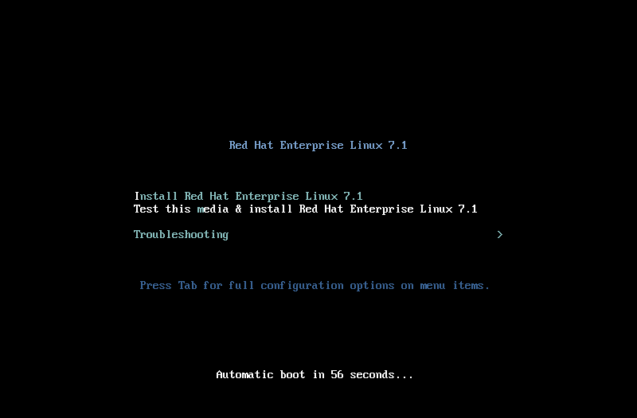
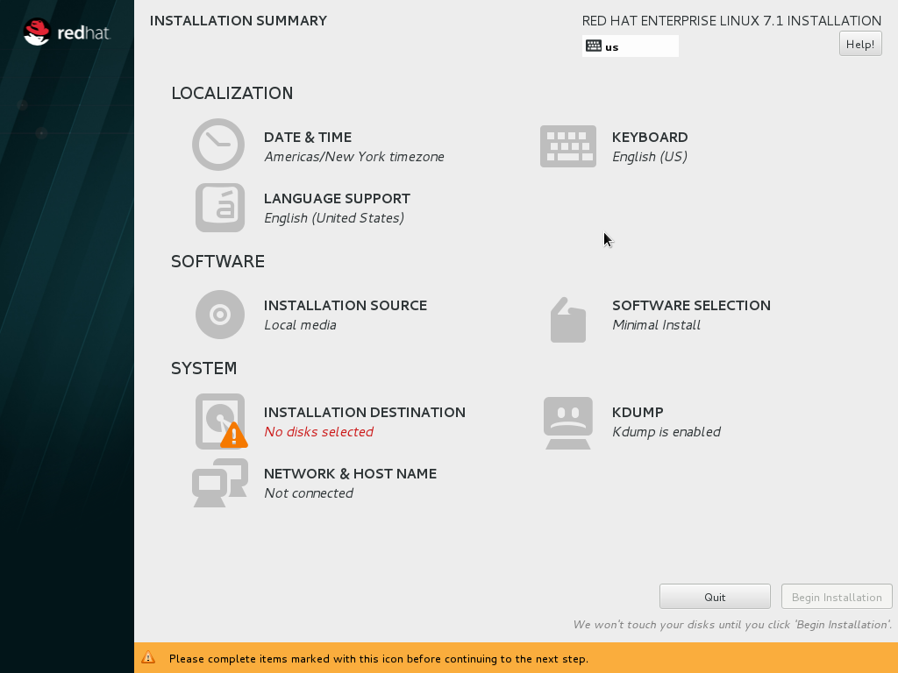
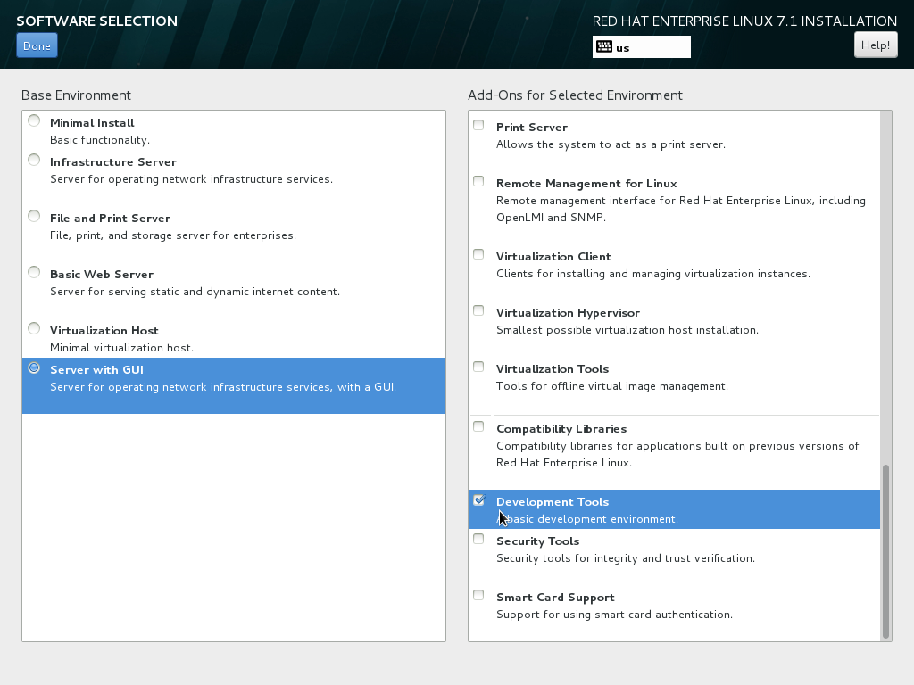
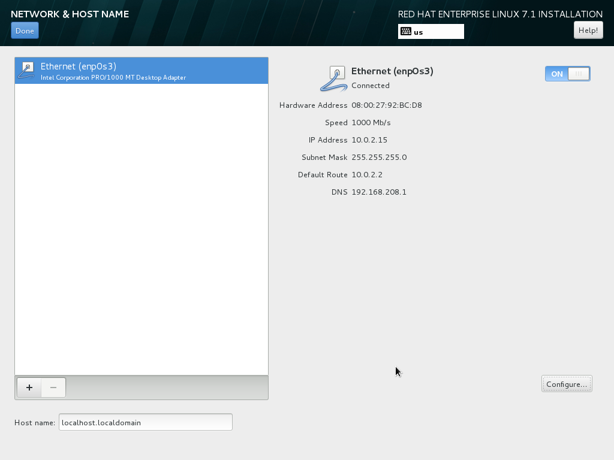
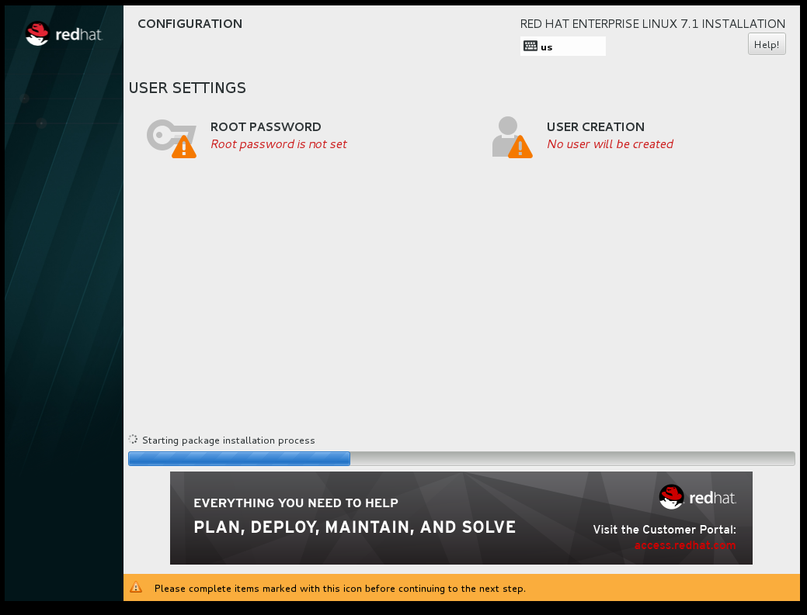
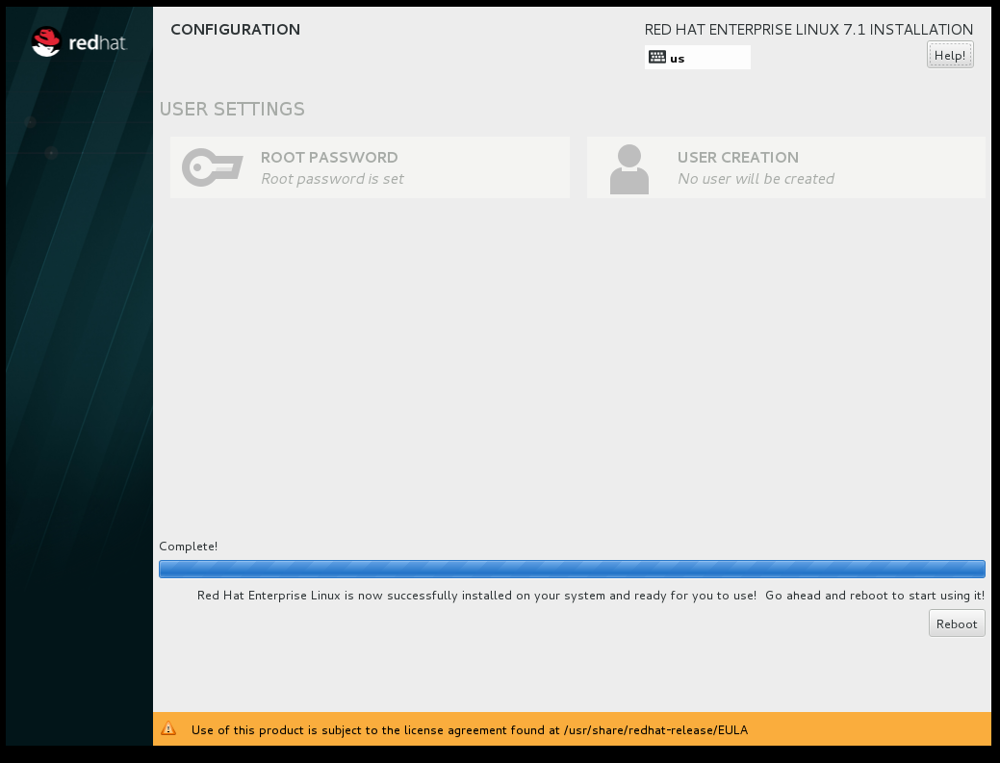

:awestruct-layout: product-get-started
:awestruct-interpolate: true

## Path Intro section
Get started with Red Hat Enterprise Linux 7 for software development.

## Prerequisites section title
Introduction and Prerequisites

## Prerequisites section
This tutorial provides an overview of the key steps for obtaining and installing Red Hat Enterprise Linux so you can get started with software development today. Red Hat Enterprise Linux and the Red Hat Enterprise Linux Developer program bridges development agility with production stability. The developer tools supplied with Red Hat Enterprise Linux are supported for 10 years. This level of stability makes Red Hat Enterprise Linux the ideal platform for development and deployment of applications with a long life cycle. For application development that requires the latest tools and technologies, link:https://access.redhat.com/products/Red_Hat_Enterprise_Linux/Developer/#dev-page=5[Red Hat Software Collections (RHSCL)] and the link:https://access.redhat.com/products/Red_Hat_Enterprise_Linux/Developer/#dev-page=6[Red Hat Developer Toolset (DTS)] provide tools that are updated annually. 

If you don’t have a Red Hat Enterprise Linux subscription, you can try it for free. Get started with an evaluation at link:https://access.redhat.com/products/red-hat-enterprise-linux/evaluation[access.redhat.com/products/red-hat-enterprise-linux/evaluation]. Select the _Red Hat Enterprise Linux Developer Workstation_ option to ensure your evaluation will include both RHSCL and DTS.

If you are interested in purchasing a Red Hat subscription for development, the link:https://access.redhat.com/products/Red_Hat_Enterprise_Linux/Developer/#dev-page=1[Red Hat Enterprise Linux Developer Suite] is an affordable choice that includes Red Hat Enterprise Linux Server, Red Hat Software Collections, and the Red Hat Developer Toolset. For developer support with a guaranteed response time service-level agreement (SLA), Red Hat Developer Workstation Professional or Enterprise subscriptions are available.

For this tutorial you will need an a 64-bit x86 physical or virtual machine with at least 16 GB of available disk space. For more detailed https://access.redhat.com/documentation/en-US/Red_Hat_Enterprise_Linux/7/html/Installation_Guide/chap-installation-planning-x86.html[minimum hardware requirements and compatibility information], see the link:https://access.redhat.com/documentation/en-US/Red_Hat_Enterprise_Linux/7/html/Installation_Guide/[Red Hat Enterprise Linux Installation Guide].

Note: This tutorial does not replace the link:https://access.redhat.com/documentation/en-US/Red_Hat_Enterprise_Linux/7/html/Installation_Guide/[Red Hat Enterprise Linux Installation Guide]. Instead, this tutorial provides an overview of the key steps to obtain and install Red Hat Enterprise Linux for software developers. For detailed instructions, see the link:https://access.redhat.com/documentation/en-US/Red_Hat_Enterprise_Linux/7/html/Installation_Guide/[Installation Guide].

If you encounter difficulties at any point in this tutorial, see <<troubleshooting,Troubleshooting and FAQ>>.

## Step1 Duration
10-20 minutes (verify?)

## Step1 Title
Obtain Red Hat Enterprise Linux

## Step2 Duration
30-60 minutes (verify?)

## Step2 Title
Install Red Hat Enterprise Linux

## Step3 Duration
10 minutes (verify?)

## Step3 Title
Getting ready for software development

## Step1 Content

In this step, you will download Red Hat Enterprise Linux from the Red Hat customer portal, link:https://access.redhat.com/[access.redhat.com]. The steps are:

. Login to link:https://access.redhat.com/[access.redhat.com].
+
If you don't have an account, link:https://www.redhat.com/wapps/ugc/register.html[register to create one].
. Obtain a link:https://access.redhat.com/products/Red_Hat_Enterprise_Linux/Developer/#dev-page=1[Red Hat Enterprise Linux subscription] if you don't already have one:
+
Purchase a developer's subscription: https://www.redhat.com/apps/store/developers/rhel_developer_suite.html[Developer Suite] or https://www.redhat.com/apps/store/developers/rhel_developer_workstation_professional.html[Developer Workstation].
+
Or, get a link:https://access.redhat.com/products/red-hat-enterprise-linux/evaluation[Red Hat Enterprise Linux Developer Workstation evaluation]. After you sign up for the evaluation you will receive an email with a link to click on to activate your 30-day evaluation.
. Download the _binary DVD ISO file_ for _link:https://access.redhat.com/downloads/content/69/ver=/rhel---7/x86_64/product-downloads[Red Hat Enterprise Linux Server]_.
+
On the download page, under _Product Variant_ select _Red Hat Enterprise Linux Server_. Choosing the _Server_ edition gives you the widest range of software to choose from. During installation you will choose the _Server with a GUI_ option for a full graphical desktop.
+
Under _Version_ select the latest released (non-beta) version of Red Hat Enterprise Linux 7. The _Architecture_ selection should be set to _x86_64_.
+
Click the _Download Now_ button for _Binary DVD_ installer.  The file size should be between 3 and 4 GBs. Do not select the much smaller smaller _Boot ISO_ as it doesn't contain the installation software.

. Create bootable installation media on a https://access.redhat.com/documentation/en-US/Red_Hat_Enterprise_Linux/7/html/Installation_Guide/chap-making-media.html#sect-making-cd-dvd-media[DVD] or https://access.redhat.com/documentation/en-US/Red_Hat_Enterprise_Linux/7/html/Installation_Guide/sect-making-usb-media.html[USB] drive.
+
Instructions for making a bootable https://access.redhat.com/documentation/en-US/Red_Hat_Enterprise_Linux/7/html/Installation_Guide/chap-making-media.html#sect-making-cd-dvd-media[DVD] or https://access.redhat.com/documentation/en-US/Red_Hat_Enterprise_Linux/7/html/Installation_Guide/sect-making-usb-media.html[USB] drive can be found in the link:https://access.redhat.com/documentation/en-US/Red_Hat_Enterprise_Linux/7/html/Installation_Guide/chap-making-media.html[Red Hat Enterprise Linux Installation Guide]

If you encounter difficulties at any point, see <<troubleshooting,Troubleshooting and FAQ>>.

## Step2 Content
This section provides a brief overview of the steps for installing Red Hat Enterprise Linux. Detailed instructions can be found in the link:https://access.redhat.com/documentation/en-US/Red_Hat_Enterprise_Linux/7/html/Installation_Guide/[Red Hat Enterprise Linux Installation Guide].

There are a few key steps to remember during the installation process:

. You will need to select an _Installation destination_, the disk or partition(s) where the software will be installed. *The disk or partition(s) you select will be overwritten.* Make sure you understand your selection before starting the installation to avoid accidental data loss.
. You should configure networking under _Network and host name_ before starting the installation. You will need access to the Internet to complete registration and download additional software. The network can be configured after the system is installed. However, the steps are more straightforward during installation.
. Select _Server with a GUI_ under _Software Selection_ so the system will boot into the full graphical environment after installation. By default, Red Hat Enterprise Linux Server, will not install a graphical desktop. Using the _server_ product variant of Red Hat Enterprise Linux gives you access to the widest range of software to develop with.
. Create your primary user acccount during installation. After the installation begins, you will be instructed to set a password for the root administrator account and be given the opportunity to create a regular user account. You should create a user before the installation process completes. You shouldn't use the root account as your primary login for development. If you don't create a user before the installation completes, you will need reboot and then login as root to create the user.

### Installation instructions

. Start the system from the bootable disk and select "Install Red hat Enterprise Linux 7".
+
// image:#{cdn(site.base_url + '/images/products/xxx/rhel7-install/rhel_7_1_a_0.png')}[Screenshot Boot Splash]

+
. Select your preferred language and keyboard layout to use during installation.
. Under _Localization_ set the date and time, and your perferred languague and keyboard layout for the installed system. Note: the _Done_ button to return to the _Installation summary_ screen is located in the upper left corner of the screen.
+
// image:#{cdn(site.base_url + '/images/products/xxx/rhel7-install/image-3-install-options-first.png')}[Screenshot Installation Options]

+
. Click _Software selection_.  Then on the next screen, under _Software selection_, in the _Base environment_ list on the left, select _Server with GUI_. Then in the list _Add-ons for selected environment_ on the right, select _Development tools_.  After you click the _Done_ button it will take several seconds to validate your choices.
+
// image:#{cdn(site.base_url + '/images/products/xxx/rhel7-install/image-4-software-selection.png')}[Screenshot Software Selection]

+
. Click _Installation destination_ to specify what disk or partition(s) to install the software on. See the link:https://access.redhat.com/documentation/en-US/Red_Hat_Enterprise_Linux/7/html/Installation_Guide/sect-disk-partitioning-setup-x86.html[Installation Destination] section of the the link:https://access.redhat.com/documentation/en-US/Red_Hat_Enterprise_Linux/7/html/Installation_Guide/[Red Hat Enterprise Linux Installation Guide].
+
. Click _Network & host name_ to configure the network. If the system has more than one network adapter, select it from the list on the left. Then, click the on/off button on the right to enable it. Click _Configure_ to adjust the settings for the adapter. Optionally, set a _Host name_ for the system.
+
// image:#{cdn(site.base_url + '/images/products/xxx/rhel7-install/image-6-network.png')}[Screenshot Network Configuration]

+
. Click the _Begin installation_ button when you are ready to start the actual installation.
. On the next screen, while the installation is running, click _User creation_ to create the user ID you will use to login under for normal work.
+
image:#{cdn(site.base_url + '/images/products/xxx/rhel7-install/rhel_7_1_c.png')}[Screenshot User Creation]

+
. Click _Root password_ to set the password for the root user.
. After the installation process completes, click the _Reboot_ button.
+
// image:#{cdn(site.base_url + '/images/products/xxx/rhel7-install/rhel_7_1_d.png')}[Screenshot Installation Complete]



If you need help, see <<troubleshooting,Troubleshooting and FAQ>>.


## Step3 Content


### Where to go next?

*link:https://access.redhat.com/articles/881893[Get Started with Docker Formatted Container Images on Red Hat Systems]* -- This article explains how to install docker on Red Hat Enterprise Linux and Atomic Host. It also provides a more extensive set examples than this tutorial. +

*link:https://access.redhat.com/articles/rhel-atomic-getting-started[Getting Started with Red Hat Enterprise Linux Atomic Host]* -- This article provides an overview of Atomic Host, how it is different, and how to use it. +

*link:[Red Hat Enterprise Linux 7.1 Release Notes] -- includes information on recent updates to https://access.redhat.com/documentation/en-US/Red_Hat_Enterprise_Linux/7/html/7.1_Release_Notes/chap-Red_Hat_Enterprise_Linux-Atomic_Host.html[Atomic Host] and https://access.redhat.com/documentation/en-US/Red_Hat_Enterprise_Linux/7/html/7.1_Release_Notes/chap-Red_Hat_Enterprise_Linux-7.1_Release_Notes-Linux_Containers_with_Docker_Format.html[Dockeer formatted Linux containers]

## More Resources

### Become a Red Hat developer: developers.redhat.com

Red Hat delivers the resources and ecosystem of experts to help you be more productive and build great solutions.  Register for free at link:http://developers.redhat.com/[developers.redhat.com].

*Follow the Red Hat Developer Blog* +
link:http://developerblog.redhat.com/[]


## Faq section title
[[troubleshooting]]Troubleshooting and FAQ

## Faq section
1. My system is unable to download updates from Red Hat.
+
I don't have a current Red Hat subscription, can I get an evaluation?
+
If you don’t have a Red Hat Enterprise Linux subscription, you can try it for free. Get started with an evaluation at link:https://access.redhat.com/products/red-hat-enterprise-linux/evaluation[].  Developers should select the Red Hat Enterprise Linux Developer Workstation option to ensure your evaluation includes additional tools from the Red Hat Developer Toolset and Red Hat Software Collections.
+
2. When I start Atomic Host, I don't see a graphical environment.
+
Atomic Host is specifically optimized for the deployment of Linux containers in environments such as Infrastructure as a Service (IaaS). It's minimal footprint contains only the software needed to efficiently host containers. Since it does not include a graphical user interface, or development tools, Atomic Host isn't suited for software development activities. Instead, developers should use Red Hat Enterprise Linux which is design to suit many purposes including desktop and server installations. See link:https://access.redhat.com/articles/881893[Get Started with Docker Formatted Container Images on Red Hat Systems]. After an application has been developed and packaged in a container, developers may want to test them on Atomic Host. Atomic Host can be helpful for developers that are creating continuous integration / continuous delivery (CI/CD) environments.
+
3. How do I tell if a container image with a new version of Python is available?
+
How can I see what other container images are available?
+
I can't find the container mentioned in this tutorial, how can I tell if the name changed?
+
To see what other containers are available in the Red Hat container registry, use one or more of the following searches:

[.code-block]
```
# docker search registry.redhat.com/openshift3
# docker search registry.redhat.com/jboss
# docker search registry.redhat.com/rhel
```
+
4. Can I run and build docker containers on Red Hat Enterprise Linux?
+
Red Hat Enterprise Linux includes docker, but it is not installed by default. See link:https://access.redhat.com/articles/881893#get[Getting Docker on RHEL 7] in the article link:https://access.redhat.com/articles/881893[Get Started with Docker Formatted Container Images on Red Hat Systems].
+
5. Where can I learn more about delivering applications with Linux containers?
+
If you haven't already joined the link:http://developers.redhat.com/[Red Hat Developers program], sign up at link:http://developers.redhat.com/[developers.redhat.com]. Membership is free.+
link:https://access.redhat.com/articles/1483053[Recommended Practices for Container Development] and many other container articles are available from the link:https://access.redhat.com/[Red Hat Customer Portal].+
If you are a Red Hat Technology Partner, visit the link:https://access.redhat.com/articles/1483053[Container Zone] at the link:http://connect.redhat.com/[Red Hat Connect for Technology Partners] web site.
