:awestruct-layout: product-get-started
:awestruct-interpolate: true

# Hyper-V Installation Guide for inclusion in combined install guide.

*Include this in Hyper-V tab of combined install guide as Steps 2 and Steps 3.*

*Bare Metal step 2 is included in this document, any changes made to the bare metal step 2, need to be made here as well!*


## Step2 content 

This step provides an overview of the key steps for installing link:http://developers.redhat.com/products/rhel/overview/[Red Hat Enterprise Linux Server] in a link:https://technet.microsoft.com/en-us/library/hh857623.aspx[Hyper-V] Virtual Machine (VM) so you can get started with software development. The VM you create will give you a Red Hat Enterprise Linux development environment that you can use on your system running Microsoft Windows 10, 8.1, or 8.0.

### Overview of steps

. Enable Hyper-V
. Configure a VM to run Red Hat Enterprise Linux.
. Boot the VM using the ISO file you downloaded in step 1 as a virtual DVD.
. Install Red Hat Enterprise Linux.

Note: This tutorial does not replace the link:https://access.redhat.com/documentation/en-US/Red_Hat_Enterprise_Linux/7/html/Installation_Guide/[Red Hat Enterprise Linux Installation Guide] or Microsoft Hyper-V documentation. Instead, this tutorial provides an overview of the key steps for software developers. For detailed instructions, see the respective manaul.

A few things to keep in mind:

* You will be using the Server edition of Red Hat Enterprise Linux. This provides you with the widest range of software to develop and test with.
* The VM will have a full graphical desktop. You will select _Server with a GUI_ during installation.
* After installation, you will configure additional software repositories that will provide you access to optional development software such as RHSCL and DTS.

### System Requirements

The requirements for your physical system that will host the Red Hat Enterprise Linux VM are:

* a 64-bit x86 machine with hardware virtualization assistance (Intel VT-X or AMD-V) and link:https://en.wikipedia.org/wiki/Second_Level_Address_Translation[Second Level Address Translation (SLAT)].
* Microsoft Windows 10, 8.1 or 8.0.
* 4 GB RAM (8 GB preferred).
* 24 GB of available disk space for the VM, the installation ISO file, and Hyper-V


If you encounter difficulties at any point in this tutorial, see <<troubleshooting,Troubleshooting and FAQ>>.


### Enable Hyper-V

This guide shows the steps for Hyper-V on Windows 10 Professional, Windows 8 and 8.1 are similar but may have small differences. Starting with Windows 8, Hyper-V replaced Microsoft Virtual PC as the desktop virtualization platform (hypervisor). Hyper-V is installed, but not enabled by default on most editions of Windows.

To enable Hyper-V the Hyper-V role:

. Right click on the Windows button and select _Programs and Features_
. Select _Turn Windows Features on or off_ from the sidebar on the left.
. Select _Hyper-V_ from the list in the _Turn Windows features on or off_ dialog.
.. Click the _Hyper-V_ checkbox.
.. Expand the _Hyper-V_ group:
... Click _Hyper-V Management Tools_ to enable it.
... Ensure that _Hyper-V Platform_ is checked.
. Click _OK_.
. Close the _Programs and Features_ window.

For more information see link:https://msdn.microsoft.com/en-us/virtualization/hyperv_on_windows/quick_start/walkthrough_install[Install Hyper-V on Windows 10] or consult the documentation for your version of Microsoft Windows. Note: some of the Hyper-V documentation may be listed as "Client Hyper-V" since Hyper-V was originally a server feature.

// image:#{cdn(site.base_url + '/images/products/rhel/rhel7-install/hyperv/hv-01-enable-role.png')}[Screenshot Enable Hyper-V Role]
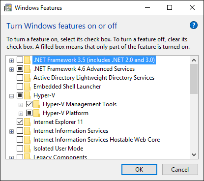


#### Enable Intel VT-x or AMD-V Virtualization in BIOS/UEFI

Intel and AMD processors have hardware extensions for accelerating virtualization. On some systems this support may be disabled by default in the system’s BIOS/UEFI.  To enable the extensions, you might have to go into the system’s BIOS/UEFI setup configuration at boot time. Consult your system’s hardware documentation for more information.


### Create and configure a VM in Hyper-V

In this step you will create and configure the VM that will run Red Hat Enterprise Linux. The physical system you are running Hyper-V on is called the _host system_ or _root partition_. The VM is called the guest system or _child partition_.

First, launch _Hyper-V Manager_ from the Windows menu.  Use the _New Virtual Machine Wizard_ dialog to configure the VM:

// image:#{cdn(site.base_url + '/images/products/rhel/rhel7-install/hyperv/hv-02-hyperv-manager.png')}[Screenshot Hyper-V Manager]
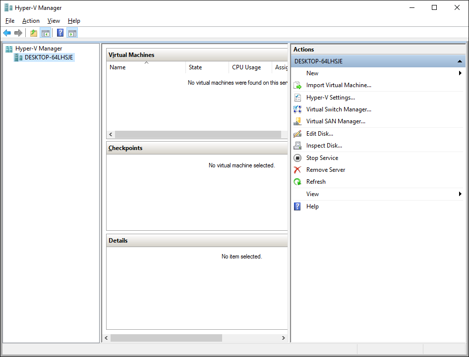

Create a new virtual network switch to provide the VM with network connectivity:

. Click _Virtual Switch Manager..._ in the right _Actions_ pane.
. Click _External_ under _What type of virtual switch do you want to create?_.
. Click _Create Virtual Switch_.
. On the _Virtual Switch Properties_ dialog:
.. Optionally, enter a name for the virtual switch.
.. Make sure that _Extneral network_ is checked.
.. If your system has more than one network adapter, such as wired and wireless, choose which network adapter the virtual switch is connected to.
.. Click _OK_.
.. Click _Yes_ in the _Apply Networking Changes_ dialog that warns about disrupting your network connection while making this change.


// image:#{cdn(site.base_url + '/images/products/rhel/rhel7-install/hyperv/hv-03-virtual-switch-2.png')}[Screenshot Virtual Switch Setup]
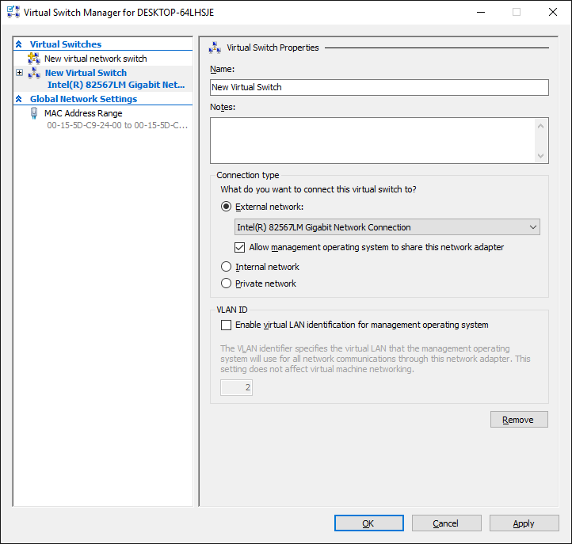


Create a VM by clicking _New_, then _Virtual Machine..._ in the _Actions_ pane on the right. The _New Virtual Machine Wizard_ dialog will pop-up. Configure the VM as follows:

. Click _Next_ to skip  _Before You Begin_.
. Under  _Specify Name and Location_:
.. Enter _rhel_ as the _Name_ of the VM.
.. Change the location to store the VM's files if necessary. The default is `C:\ProgramData\Microsoft\Windows\Hyper-V\`. Note: you will be prompted later for the location of the VM's virtual hard disk.
.. Click _Next_.
. Under _Specify Generation_:
.. make sure _Generation 1_ is checked.
.. click _Next_.
. Under _Assign Memory_, set the amount of memory available to the VM. The suggested is value is 4096 MB. The minimum is 2048 MB.
.. Click _Next_.
. Under _Configure Networking_:
.. Select the virtual switch you created earlier from the _Connection_ list.
.. Click _Next_.
. Under _Connect Virtual Hard Disk_ you will configure the new VM's virtual hard disk (VHD). You will need at least 20 GB of free space to store the VM's VHD. While this setting can be changed later, it is a multi-step process not covered by this guide. Therefore it is recommended that you size the VHD to be large enough for your software development activities. 
.. Select _Create a virtual hard disk_ if it isn't already checked.
.. Enter `rhel.vhdx` as the _Name_ of the virtual hard disk.
.. Change the _Location_ if necessary. By default the VHD will be stored in `C:\Users\`.
.. Set the size to _20 GB_ or larger.
.. Click _Next_.
+
// image:#{cdn(site.base_url + '/images/products/rhel/rhel7-install/hyperv/hv-07-vhd.png')}[Screenshot Virtual Hard Disk Settings]
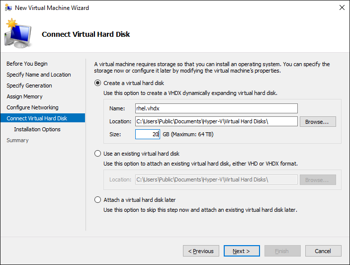
+
. Under _Installation Options_:
.. Select _Install an operating system from a bootable CD/DVD-ROM_. 
.. Select _Image fie (.iso)_.
.. Enter the location or click _Browse..._ to navigate to the Red Hat Enterprise Linux Server DVD `.iso` file you downloaded in step 1.
+
// image:#{cdn(site.base_url + '/images/products/rhel/rhel7-install/hyperv/hv-08-iso.png')}[Screenshot Virtual CD/DVD Settings]
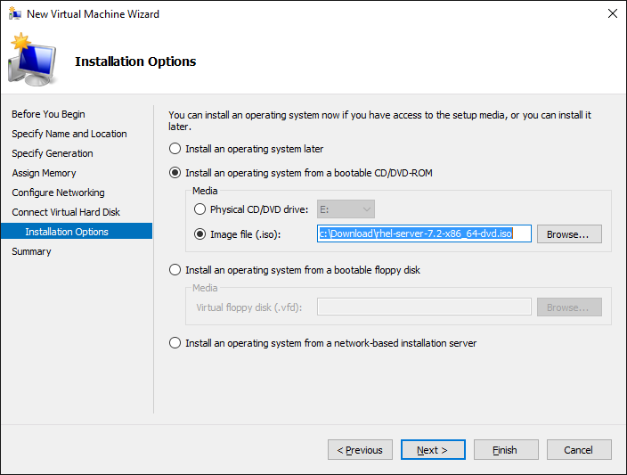
+
.. Click _Next_.
. Check your settings on the _Summary_ dialog.  Then, click _Finish_ to create the VM.
+
// image:#{cdn(site.base_url + '/images/products/rhel/rhel7-install/hyperv/hv-09-summary.png')}[Screenshot VM Settings Summary]
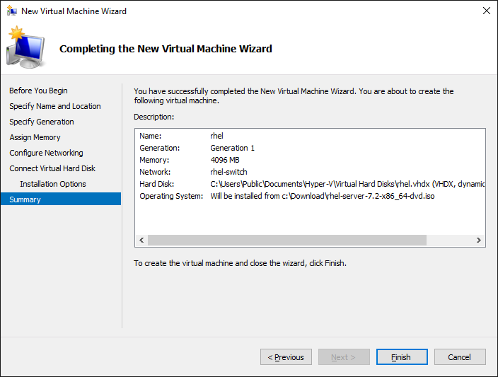


### Boot the VM and install Red Hat Enterprise Linux

To start the VM and begin installation, start _Hyper-V Manager_ if it isn’t already running, then locate the _rhel_ VM in the _Action_ pane on the right and click _Start_. The VM should now boot up from the Red Hat Enterprise Linux Server DVD.

This section provides a brief overview of the steps for installing Red Hat Enterprise Linux. Detailed instructions can be found in the link:https://access.redhat.com/documentation/en-US/Red_Hat_Enterprise_Linux/7/html/Installation_Guide/[Red Hat Enterprise Linux Installation Guide].

There are a few key steps to remember during the installation process:

. The _Installation destination_ will be the virtual hard disk you created for the VM.
. You should configure networking under _Network and host name_ before starting the installation. You will need access to the Internet to complete registration and download additional software. The network can be configured after the system is installed. However, the steps are more straightforward during installation.
. Select _Server with a GUI_ under _Software Selection_ so the system will boot into the full graphical environment after installation. By default, Red Hat Enterprise Linux Server will not install a graphical desktop.
. Create your primary user account during installation: After the installation begins, you will be instructed to set a password for the root account and be given the opportunity to create a regular user account. You should create a user before the installation process completes. The regular user will be your primary login for development. The root account should only be used for system administration tasks. If you don't create a user before the installation completes, you will need to reboot and then log in as root to create user accounts.

// BEGIN STEP 2 - KEEP THIS IN SYNC WITH BARE METAL
### Installation instructions

. Start the system from the bootable disk and select _Install Red Hat Enterprise Linux_.
+
// image:#{cdn(site.base_url + '/images/products/xxx/rhel7-install/rhel-72/rhel-01-boot-dvd.png')}[Screenshot Boot Splash]
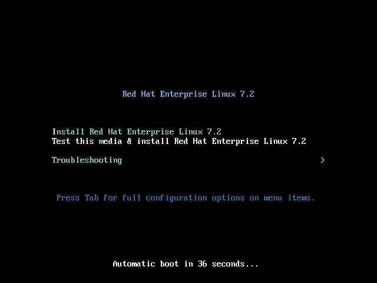
+
. Select your preferred language and keyboard layout to use during installation.
. Under _Localization_ review the settings and make any necessary changes for date and time, language, and keyboard layout. Note: The _Done_ button to return to the _Installation summary_ screen is located in the upper left corner of the screen.
+
// image:#{cdn(site.base_url + '/images/products/xxx/rhel7-install/rhel-72/rhel-03-install-options-first.png')}[Screenshot Installation Options]
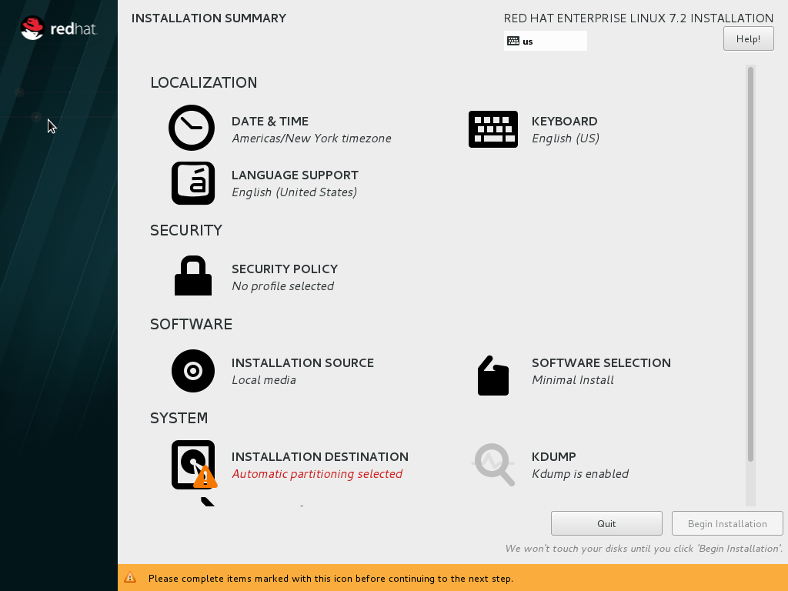
+
. Perform the follow steps to make your software selection:
.. Click _Software selection_.
.. On the next screen, under _Software selection_, in the _Base environment_ list on the left, select _Server with GUI_.
.. In the list _Add-ons for selected environment_ on the right, select _Development tools_.
.. Click the _Done_ button. Note: After returning to the _Installation summary_ screen it will take several seconds to validate your choices.
+
// image:#{cdn(site.base_url + '/images/products/xxx/rhel7-install/rhel-72/rhel-04-software-selection.png')}[Screenshot Software Selection]
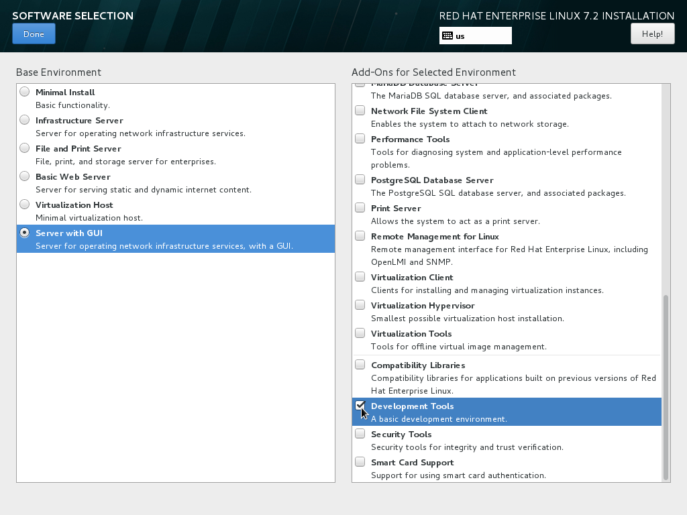
+
. Click _Installation destination_ to specify which disk or partition(s) to install the software on. Note: It is important that you understand the choices that you are making in this section to avoid accidental data loss. It is strongly recommended that you read the link:https://access.redhat.com/documentation/en-US/Red_Hat_Enterprise_Linux/7/html/Installation_Guide/sect-disk-partitioning-setup-x86.html[Installation Destination] section of the the link:https://access.redhat.com/documentation/en-US/Red_Hat_Enterprise_Linux/7/html/Installation_Guide/[Red Hat Enterprise Linux Installation Guide]. The installation destination should be at least 16 GB or larger to accommodate the OS, graphical desktop, and development tools.
+
. Click _Network & host name_ to configure the network. If the system has more than one network adapter, select it from the list on the left. Then click the _On/Off_ button on the right to enable the network adapter. Click _Configure_ to review and/or change the default settings for the network adapter. Optionally, set a _Host name_ for the system. Before leaving this screen, make sure there is at least one network adapter enabled with the switch in the _On_ position. A network connection will be required to register the system and download system updates.
+
// image:#{cdn(site.base_url + '/images/products/xxx/rhel7-install/rhel-72/rhel-07-network.png')}[Screenshot Network Configuration]
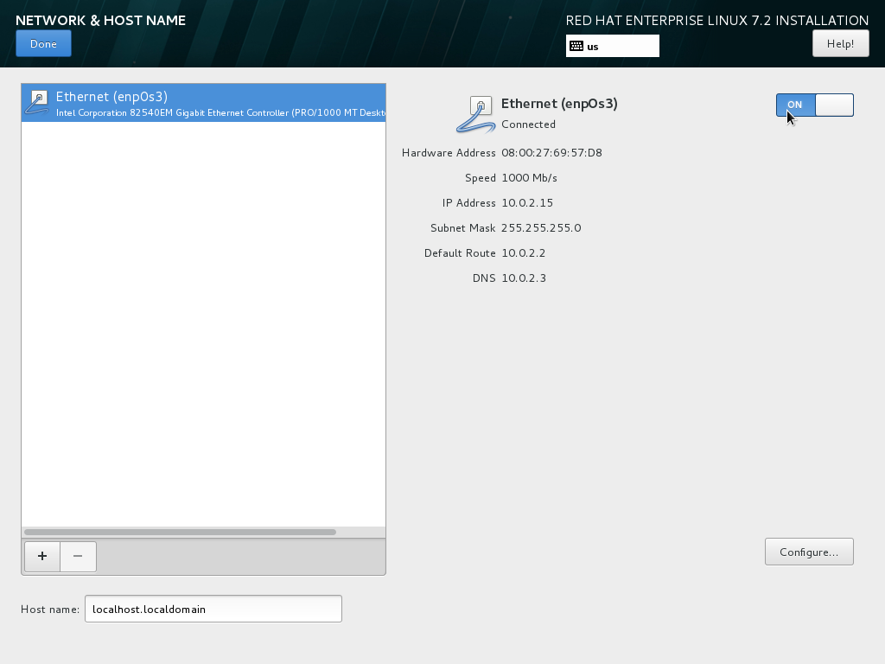
+
. Click _KDump_ to disable KDump and free up memory. Click the box next to _Enable kdump_ so that it is no longer checked.  Then click _Done_.
. Click the _Begin installation_ button when you are ready to start the actual installation.
. On the next screen, while the installation is running, click _User creation_ to create the user ID you will use to log in for normal work.
+
// image:#{cdn(site.base_url + '/images/products/xxx/rhel7-install/rhel-72/rhel-09-user-before.png')}[Screenshot User Creation]
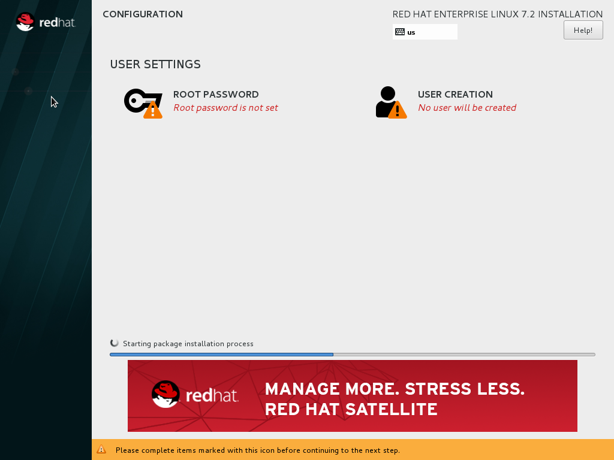
+
. Click _Root password_ to set the password for the root user. Note: If you choose a password that the system considers to be weak, you will need to click _Done_ twice.
. After the installation process completes, click the _Reboot_ button.
+
// image:#{cdn(site.base_url + '/images/products/xxx/rhel7-install/rhel-72/rhel-12-install-finished.png')}[Screenshot Installation Complete]
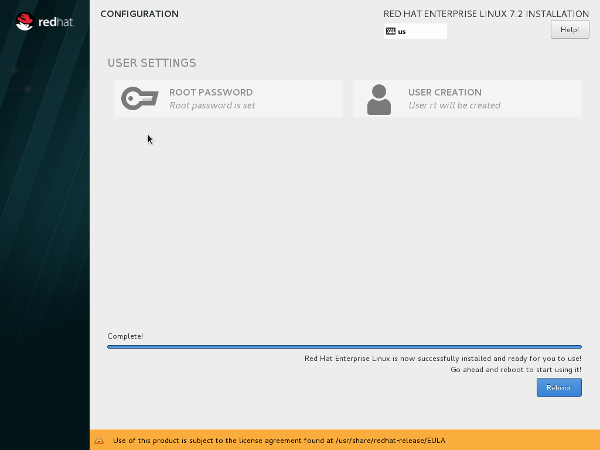


If you need help, see <<troubleshooting,Troubleshooting and FAQ>>.

// END STEP 2 - KEEP THIS IN SYNC WITH BARE METAL
// BEGIN STEP 3 - This is a SUPERSET of bare metal STEP 3. Keep in sync.
## Step3 Content

This section has a number of post-installation steps that complete the installation of Red Hat Enterprise Linux and prepare it for software development. The steps are:

. Accept the license agreements and register the system with the Red Hat Subscription Management..
. Install the latest software updates and Microsoft Hyper-V Integration Services on the VM.
. Add additional software repositories containing development software.


### Complete installation and register the system

After installation, during the first boot of the system, you will be asked to accept the license agreement and register the system with Red Hat Subscription Management. Completing these steps are required for your system to download software from Red Hat.


// image:#{cdn(site.base_url + '/images/products/xxx/rhel7-install/rhel-72/rhel-13-firstboot-config.png')}[Screenshot Installation Complete]
image:images/rhel7-install/rhel-72/rhel-13-firstboot-config.png[Screenshot Installation Complete]

. Click _License information_ to go the license acceptance screen.
.. Click the checkbox to accept the license.
.. Click _Done_ in the upper left corner to return to the configuration screen.
. If you didn't configure a network during installation, click _Network and host name_ to configure your network connection.
. Click to On the _Subscription Management Registration_ screen
.. if you need to configure an HTTP proxy server, click _Configure Proxy_
.. Click _Next_ to move the next screen.
// image:#{cdn(site.base_url + '/images/products/xxx/rhel7-install/rhel-72/rhel-15b-subscription-credentials.png')}[Screenshot Installation Complete]
image:images/rhel7-install/rhel-72/rhel-72/rhel-15b-subscription-credentials.png[Screenshot Installation Complete]
. Register your system with Red Hat. Use the same username and password that you created for the Red Hat Customer Portal.  Note: For this step to succeed, you must have configured your network connection.
.. If you have more than one subscription available, select which subscription to attach this installation to
.. Click _Done_.
+
. Click _Finish configuration_ when you are done.
+
// If you are using an evaluation, you must first agree to the terms and conditions at link:https://www.redhat.com/wapps/ugc/[www.redhat.com/wapps/ugc/].
+
. Log in to the system with the username and password you created during installation.
+
If you didn't create a regular user, you will need to log in as root and create a user. See <<troubleshooting,Troubleshooting and FAQ>>.
+
If you get a text-based login screen instead of a graphical one, see <<troubleshooting,Troubleshooting and FAQ>>.
+
. Select your preferred language.

### Disable lock screen and screen power saving

For security and to save energy, the default configuration of Red Hat Enterpise Linux is to lock the screen and turn the screen off when idle. On a VM, it is best to disable these features since the host system will control screen locking and power saving.

To disable these features, from the desktop _Application_ menu, select the _System Tools_ group, then select _Settings_. Follow these steps in the _Settings_ application.

. Click the _Privacy_ icon to bring up the _Privacy_ dialog.
. Click on _Screen Lock_ to bring up the _Screen Lock_ dialog.
. Click on the _On/Off_ switch to the right of _Automatic Screen Lock_.
. Click the _X_ in the upper right hand corner to dismiss the _Screen Lock_ dialog.
. Click the _<_ button in the upper left corner of the _Privacy_ dialog to go back to the main _Settings_ screen.
. Click on the _Power_ icon to open the _Power settings_ dialog.
. Click the menu button to the right of _Blank screen_. Select _Never_ from the list of choices.
. Finally, Click the ‘X’ in the upper right hand corner to close the _Settings_ application.


### Install the latest updates

In this step, you will download and install the latest updates for your system from Red Hat. In the process, you will verify that your system has a current Red Hat subscription and is able to receive updates.

First, start a _Terminal_ window from the _Application_ menu.  Then, after using `su` to change to the root user ID, use `subscription-manager` to verify that you have access to Red Hat software repositories. 

[.code-block]
```
$ su -
# subscription-manager repos --list-enabled
```

If you don’t see any enabled repositories, your system might not be registered with Red Hat or might not have a valid subscription. See <<troubleshooting,Troubleshooting and FAQ>> for more information.

Now download and install any available updates by running `yum update`.  If updates are available, `yum` will list them and ask if it is OK to proceed.

`# yum update`

### Enable additional software repositories

In this step you will configure your system to obtain software from the _Optional RPMs_ and _RHSCL_ software repositories. The _Optional RPMs_ repository includes a number of development packages. The RHSCL repository includes the both the RHSCL software collections as well as DTS (the Red Hat Developer Toolset).

[.code-block]
```
# subscription-manager repos --enable rhel-server-rhscl-7-rpms
# subscription-manager repos --enable rhel-7-server-optional-rpms
```

// [*FIXME* - Install Hyper-V Integration Services]
//
// Once the installation is complete reboot the VM.  To do this using the command line:

Finally, reboot the VM.

```
# reboot
```

// End of Hyper-V tab

## Step4 Content
