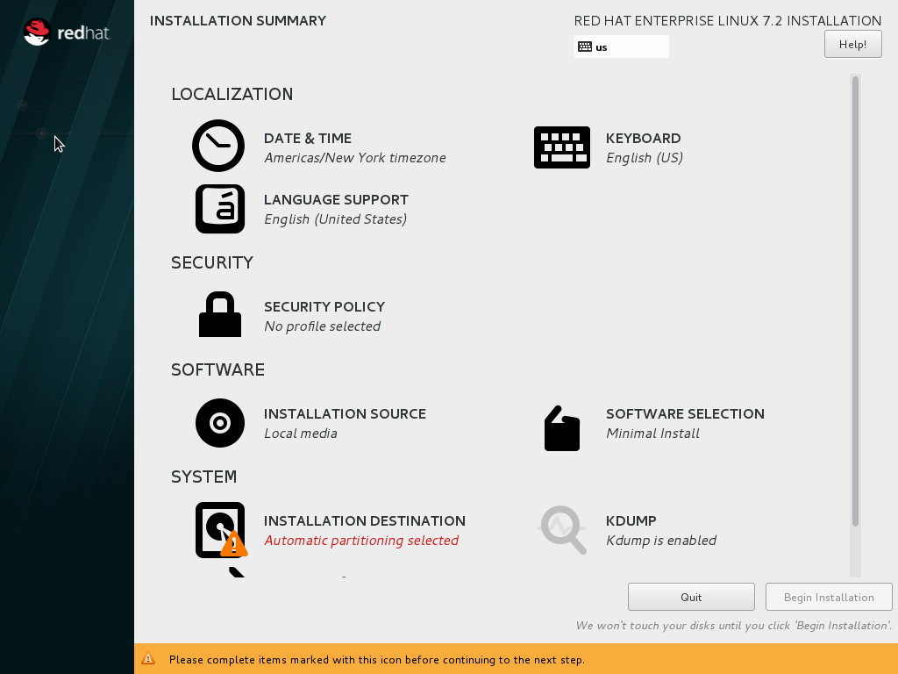
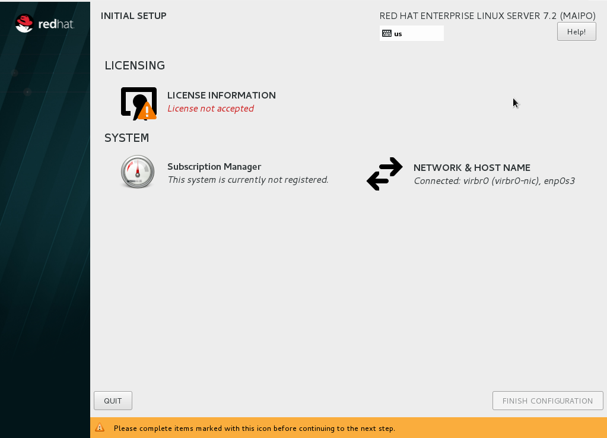

:awestruct-layout: product-get-started
:awestruct-interpolate: true

# VMware Installation Guide for inclusion in combined install guide.

*Include this in VMware tab of combined install guide as Steps 2 and Steps 3.*

*Bare Metal step 2 is included in this document, any changes made to the bare metal step 2, need to be made here as well!*


## Step2 content 

This step provides an overview of the key steps for installing link:http://developers.redhat.com/products/rhel/overview/[Red Hat Enterprise Linux Server] in a link:http://www.vmware.com/[VMware] Virtual Machine (VM) so you can get started with software development. The VM you create will give you a Red Hat Enterprise Linux development environment that you can use on your system running Microsoft Windows or Mac OS X.

### Overview of steps

. Download and install VMware
. Configure a VM to run Red Hat Enterprise Linux.
. Boot the VM using the ISO file you downloaded in step 1 as a virtual DVD.
. Install Red Hat Enterprise Linux.

Note: This tutorial does not replace the link:https://access.redhat.com/documentation/en-US/Red_Hat_Enterprise_Linux/7/html/Installation_Guide/[Red Hat Enterprise Linux Installation Guide] or link:https://www.vmware.com/support/pubs/[VMware documentation]. Instead, this tutorial provides an overview of the key steps for software developers. For detailed instructions, see the respective manual.

A few things to keep in mind:

* You will be using the Server edition of Red Hat Enterprise Linux. This provides you with the widest range of software to develop and test with.
* The VM will have a full graphical desktop. You will select _Server with a GUI_ during installation.
* After installation, you will configure additional software repositories that will provide you access to optional development software such as RHSCL and DTS.

### System Requirements

The requirements for your physical system that will host the Red Hat Enterprise Linux VM are:

* a 64-bit x86 machine with hardware virtualization assistance (Intel VT-X or AMD-V).
* 4 GB RAM (8 GB preferred).
* 24 GB of available disk space for the VM, the installation ISO file, and VMware.
* A processor with hardware virtualization assistance (Intel VT-x or AMD-V).


If you encounter difficulties at any point in this tutorial, see <<troubleshooting,Troubleshooting and FAQ>>.


### Download and install VMware.

You will need to download a VMware desktop virtualization product for your system:

* Microsoft Windows: link:https://www.vmware.com/products/workstation/[VMware Workstation Pro] or link:https://www.vmware.com/products/player/[VMware Workstation Player].
* Apple Mac OS X: VMware link:https://www.vmware.com/products/fusion/[Fusion] or link:https://www.vmware.com/products/fusion-pro/[VMware Fusion Pro].

After the download completes, click on the downloaded `.exe` or `.dmg` file to start the installation. During the installation you will need to agree to using administrative privileges for a number of the steps.

The Windows enhanced virtual keyboard driver is not required. You may install it if needed for improved support of international keyboards.

Note: This guide uses VMware Workstation 12 and VMware Fusion 8. Older versions may work but the steps might be slightly different.


#### Enable Intel VT-x or AMD-V Virtualization in BIOS/UEFI

Intel and AMD processors have hardware extensions for accelerating virtualization. On some systems this support may be disabled by default in the system’s BIOS/UEFI.  To enable the extensions, you might have to go into the system’s BIOS/UEFI setup configuration at boot time. Consult your system’s hardware documentation for more information.

#### Disable Microsoft Hyper-V to avoid conflicts with VMware

On some Microsoft Windows systems it may be necessary to disable Microsoft Hyper-V virtualization in order to use VMware. Only one virtualization platform, or hypervisor, can be active on a host system at a time. While hypervisors like VMware only take control of the host system’s hardware virtualization capabilities when they are actually running a VM, Microsoft Hyper-V takes control at boot time. In order to use VMware, Hyper-V must either be disabled or uninstalled. Consult Microsoft’s  documentation for more information. Note: if you are interested in using Microsoft Hyper-V instead of VMware, check the link:http://developers.redhat.com/[Red Hat Developers site] for a Hyper-V edition of this guide.

### Create and configure a VM in VMware

In this step you will create and configure the VM that will run Red Hat Enterprise Linux. The system you are running VMware on is called the _host system_. The operating system running inside the VM is referred to as the guest.

First, launch VMware from your system’s menu. The follow the steps for your operating system.

#### VMware Workstation Pro or Player on Microsoft Windows

Click _Create a New Virtual Machine_ to bring up the _New Virtual Machine Wizard_ dialog:

. On the _Welcome to the New Virtual Machine Wizard_ dialog:
.. Select _Installer disc image file (.iso)_
.. Click _Browse_, then locate the ISO file you downloaded in step 1.
.. Click _Next_.
+
// image:#{cdn(site.base_url + '/images/products/rhel/rhel7-install/vmware-win/vmw-01-create-iso.png')}[Screenshot Create VM]

+
. On the _Select a Guest Operating System_ dialog
.. Select _Linux_ under _Guest Operating _system
.. Select _Red Hat Enterprise Linux 7 64-bit_ from the list of choices under _Version_.
+
// image:#{cdn(site.base_url + '/images/products/rhel/rhel7-install/vmware-win/vmw-02-create-os.png[Screenshot Create VM OS Type]

+
.. Click _Next_.
. On the _Name the Virtual Machine_ dialog:
.. Enter `rhel` or your preferred name in the _Virtual machine name_ box.
.. Change the _location_ of the VMs files, including the virtual hard disk if necessary. By default it will be placed in your _Documents_ folder. You will need 20 GB of space in the chosen location.
+
// image:#{cdn(site.base_url + '/images/products/rhel/rhel7-install/vmware-win/vmw-03-create-name.png[Screenshot Create VM name]
image::images/rhel7-install/vmware-win/vmw-03-create-name.png[Screenshot Create VM name]
+
. On the _Specify Disk Capacity_ dialog you will set the size of the VM's virtual hard disk. The size of the virtual hard disk, should be a minimum of 20 GB. While this setting can be changed later, it is a multi-step process not covered by this guide. Therefore it is recommended that you size the virtual hard disk to be large enough for your software development activities. Note: The space on your host system's physical disk will not be allocated until it is used by the VM. Complete the next set of dialogs to configure the virtual hard disk
.. Change the _Maximum disk size (GB)_ if needed. The default is 20 GB.
.. Click _Next_.
+
// image:#{cdn(site.base_url + '/images/products/rhel/rhel7-install/vmware-win/vmw-04-create-disk-size.png[Screenshot Create VM disk size]

+
. Click _Finish_ to create the VM.
+
// image:#{cdn(site.base_url + '/images/products/rhel/rhel7-install/vmware-win/vmw-05-create-finish.png[Screenshot Create VM finished]

+

At this point the basic VM configuration has been completed. You may optionally change the configuration:

. Select the newly created VM from the _Home_ list on the left side.  Then click _Edit virtual machine settings_ on the lower right to bring up the _Virtual Machine Settings_ dialog. On the _Hardware_ tab:
.. Adjust the amount of _Memory_ (RAM) if desired. A 2 GB or more is suggested for development.
.. By default, the VM will have a single virtual processor. If your system has multiple processors or cores, you can add more to the VM.
.. Under _Network Adapter_, you can set the VM’s networking configuration. The default is Network Address Translation (NAT) which is the easiest to manage. You may want to choose _Bridged_ to attach the VM directly to the physical network. See <<VMware Networking>> below for more information.
. Click _OK_ to close the _Virtual Machine Settings_ dialog.

#### VMware Fusion or VMware Fusion Pro on Mac OS X

When you launch VMware Fusion without having any VM's it will automatically open dialog to begin creating a VM. If you already have a VM created, select _New_ from the _File_ menu. At the select

. Click _Create a custom virtual machine_ on the _Select the Installation Method_ dialog. Then, click _Continue_.
+
// image:#{cdn(site.base_url + '/images/products/rhel/rhel7-install/vmware-mac/vmf-01-create.png')}[Screenshot Create VM]

+
. Select _Linux_ on the left side of the _Choose Operating System_ dialog.
.. Select _Red Hat Enterprise Linux 7 64-bit_ from the list on the right.
.. Click _Continue_.
+
// image:#{cdn(site.base_url + '/images/products/rhel/rhel7-install/vmware-mac/vmf-02-create-os.png[Screenshot Create VM Choose OS]

+
. Click _Continue_ on the _Choose a Virtual Disk_ dialog. The option _Create a new virtual disk_ should be selected by default. The default virtual disk size is 20 GB. 
+
// image:#{cdn(site.base_url + '/images/products/rhel/rhel7-install/vmware-mac/vmf-03-create-disk.png[Screenshot Create VM Create Disk]

+
. Click _Finish_.
+
// image:#{cdn(site.base_url + '/images/products/rhel/rhel7-install/vmware-mac/vmf-04-create-finish.png[Screenshot Create VM Create Finished]

+
. Choose the name and location to start the VM files. Note: By default it will be placed in your _Documents_ folder. You will need at least 20 GB of space in the chosen location.
.. Set the VM name to `rhel` in the _Save As_ box.
.. Change the location for the files in the _Where_ box if needed.
.. Click _Save_.
. At this point the basic VM configuration has been completed, but some additional configuration is needed. Click the Settings button (wrench icon), or select _Settings_ from the _Virtual Machine_ menu.
+
// image:#{cdn(site.base_url + '/images/products/rhel/rhel7-install/vmware-mac/vmf-05-settings.png[Screenshot VM Settings]

+
. Click the _CD/DVD_ icon in the _VM Settings_ dialog.
.. Select _Choose a disk or disk image..._  from the CD/DVD dialog. By default it is set to _Autodetect_.
.. In the file dialog, Navigate to the location of the `.iso` file you downloaded in step 1.  Then click _Open_.
.. Click the _Connect CD/DVD Drive_ check box.
.. Click _Show All_ to return to _VM Settings_.
. Optionally, you can tailor the configuration of the VM to suit your needs. 
.. You can adjust the amount of memory and number of CPUs available to the VM by clicking the _Processors & Memory_ icon.
+
// image:#{cdn(site.base_url + '/images/products/rhel/rhel7-install/vmware-mac/vmf-06-settings-cpu-memory.png[Screenshot CPU and Memory Settings]

+
.. You can change the size of the virtual hard disk by clicking the _Hard Disk_ icon. The size of the virtual hard disk, should be a minimum of 20 GB. While this setting can be changed later, it is a multi-step process not covered by this guide. Therefore it is recommended that you size the virtual hard disk to be large enough for your software development activities. Note: The space on your host system's physical disk will not be allocated until it is used by the VM.
.. Under _Network Adapter_, you can set the VM’s networking configuration. The default is Network Address Translation (NAT) which is the easiest to manage. You may want to choose _Bridged_ to attach the VM directly to the physical network. See <<VMware Networking>> below for more information.
+
// image:#{cdn(site.base_url + '/images/products/rhel/rhel7-install/vmware-mac/vmf-07-settings-network.png[Screenshot VM Network Settings]
image::images/rhel7-install/vmware-mac/vmf-07-settings-network.png[Screenshot VM Network Settings]
+
. Close the _VM settings_ dialog.


### Boot the VM and install Red Hat Enterprise Linux

To start the VM and begin installation, start VMware if it isn’t already running, then select your VM and click the Play button. The VM should now boot up from the Red Hat Enterprise Linux Server DVD `.iso` file.

Note: When you click inside the VM window, the keyboard and mouse will be captured by the VM until you hit _Ctrl_ and _Alt_ on Windows or the left option key on the Mac. When the system is fully installed this will no longer be necessary. See <<Open VM Tools replaces VMware Tools for Linux>>. 

This section provides a brief overview of the steps for installing Red Hat Enterprise Linux. Detailed instructions can be found in the link:https://access.redhat.com/documentation/en-US/Red_Hat_Enterprise_Linux/7/html/Installation_Guide/[Red Hat Enterprise Linux Installation Guide].

There are a few key steps to remember during the installation process:

. The _Installation destination_ will be the virtual hard disk you created for the VM.
. You should configure networking under _Network and host name_ before starting the installation. You will need access to the Internet to complete registration and download additional software. The network can be configured after the system is installed. However, the steps are more straightforward during installation.
. Select _Server with a GUI_ under _Software Selection_ so the system will boot into the full graphical environment after installation. By default, Red Hat Enterprise Linux Server will not install a graphical desktop.
. Create your primary user account during installation: After the installation begins, you will be instructed to set a password for the root account and be given the opportunity to create a regular user account. You should create a user before the installation process completes. The regular user will be your primary login for development. The root account should only be used for system administration tasks. If you don't create a user before the installation completes, you will need to reboot and then log in as root to create user accounts.

// BEGIN STEP 2 - KEEP THIS IN SYNC WITH BARE METAL
### Installation instructions

. Start the system from the bootable disk and select _Install Red Hat Enterprise Linux_.
+
// image:#{cdn(site.base_url + '/images/products/xxx/rhel7-install/rhel-72/rhel-01-boot-dvd.png')}[Screenshot Boot Splash]
image::images/rhel7-install/rhel-72/rhel-01-boot-dvd.png[Screenshot Boot Splash]
+
. Select your preferred language and keyboard layout to use during installation.
. Under _Localization_ review the settings and make any necessary changes for date and time, language, and keyboard layout. Note: The _Done_ button to return to the _Installation summary_ screen is located in the upper left corner of the screen.
+
// image:#{cdn(site.base_url + '/images/products/xxx/rhel7-install/rhel-72/rhel-03-install-options-first.png')}[Screenshot Installation Options]

+
. Perform the follow steps to make your software selection:
.. Click _Software selection_.
.. On the next screen, under _Software selection_, in the _Base environment_ list on the left, select _Server with GUI_.
.. In the list _Add-ons for selected environment_ on the right, select _Development tools_.
.. Click the _Done_ button. Note: After returning to the _Installation summary_ screen it will take several seconds to validate your choices.
+
// image:#{cdn(site.base_url + '/images/products/xxx/rhel7-install/rhel-72/rhel-04-software-selection.png')}[Screenshot Software Selection]
image::images/rhel7-install/rhel-72/rhel-04-software-selection.png[Screenshot Software Selection]
+
. Click _Installation destination_ to specify which disk or partition(s) to install the software on. Note: It is important that you understand the choices that you are making in this section to avoid accidental data loss. It is strongly recommended that you read the link:https://access.redhat.com/documentation/en-US/Red_Hat_Enterprise_Linux/7/html/Installation_Guide/sect-disk-partitioning-setup-x86.html[Installation Destination] section of the the link:https://access.redhat.com/documentation/en-US/Red_Hat_Enterprise_Linux/7/html/Installation_Guide/[Red Hat Enterprise Linux Installation Guide]. The installation destination should be at least 20 GB or larger to accommodate the OS, graphical desktop, and development tools.
+
. Click _Network & host name_ to configure the network. If the system has more than one network adapter, select it from the list on the left. Then click the _On/Off_ button on the right to enable the network adapter. Click _Configure_ to review and/or change the default settings for the network adapter. Optionally, set a _Host name_ for the system. Before leaving this screen, make sure there is at least one network adapter enabled with the switch in the _On_ position. A network connection will be required to register the system and download system updates.
+
// image:#{cdn(site.base_url + '/images/products/xxx/rhel7-install/rhel-72/rhel-07-network.png')}[Screenshot Network Configuration]
image:images/rhel7-install/rhel-72/rhel-07-network.png[Screenshot Network Configuration]
+
. Click _KDump_ to disable KDump and free up memory. Click the box next to _Enable kdump_ so that it is no longer checked.  Then click _Done_.
. Click the _Begin installation_ button when you are ready to start the actual installation.
. On the next screen, while the installation is running, click _User creation_ to create the user ID you will use to log in for normal work.
+
// image:#{cdn(site.base_url + '/images/products/xxx/rhel7-install/rhel-72/rhel-09-user-before.png')}[Screenshot User Creation]
image:images/rhel7-install/rhel-72/rhel-09-user-before.png[Screenshot User Creation]
+
. Click _Root password_ to set the password for the root user. Note: If you choose a password that the system considers to be weak, you will need to click _Done_ twice.
. After the installation process completes, click the _Reboot_ button.
+
// image:#{cdn(site.base_url + '/images/products/xxx/rhel7-install/rhel-72/rhel-12-install-finished.png')}[Screenshot Installation Complete]
image:images/rhel7-install/rhel-72/rhel-12-install-finished.png[Screenshot Installation Complete]


If you need help, see <<troubleshooting,Troubleshooting and FAQ>>.

// END STEP 2 - KEEP THIS IN SYNC WITH BARE METAL
// BEGIN STEP 3 - This is a SUPERSET of bare metal STEP 3. Keep in sync.
## Step3 Content

This section has a number of post-installation steps that complete the installation of Red Hat Enterprise Linux and prepare it for software development. The steps are:

. Accept the license agreements and register the system with the Red Hat Subscription Management..
. Add additional software repositories containing development software.


### Complete installation and register the system

After installation, during the first boot of the system, you will be asked to accept the license agreement and register the system with Red Hat Subscription Management. Completing these steps are required for your system to download software from Red Hat.


// image:#{cdn(site.base_url + '/images/products/xxx/rhel7-install/rhel-72/rhel-13-firstboot-config.png')}[Screenshot Installation Complete]


. Click _License information_ to go the license acceptance screen.
.. Click the check box to accept the license.
.. Click _Done_ in the upper left corner to return to the configuration screen.
. If you didn't configure a network during installation, click _Network and host name_ to configure your network connection.
. Click to On the _Subscription Management Registration_ screen
.. if you need to configure an HTTP proxy server, click _Configure Proxy_
.. Click _Next_ to move the next screen.
// image:#{cdn(site.base_url + '/images/products/xxx/rhel7-install/rhel-72/rhel-15b-subscription-credentials.png')}[Screenshot Installation Complete]
image:images/rhel7-install/rhel-72/rhel-72/rhel-15b-subscription-credentials.png[Screenshot Installation Complete]
. Register your system with Red Hat. Use the same username and password that you created for the Red Hat Customer Portal.  Note: For this step to succeed, you must have configured your network connection.
.. If you have more than one subscription available, select which subscription to attach this installation to
.. Click _Done_.
+
. Click _Finish configuration_ when you are done.
+
// If you are using an evaluation, you must first agree to the terms and conditions at link:https://www.redhat.com/wapps/ugc/[www.redhat.com/wapps/ugc/].
+
. Log in to the system with the username and password you created during installation.
+
If you didn't create a regular user, you will need to log in as root and create a user. See <<troubleshooting,Troubleshooting and FAQ>>.
+
If you get a text-based login screen instead of a graphical one, see <<troubleshooting,Troubleshooting and FAQ>>.
+
. Select your preferred language.

### Disable lock screen and screen power saving

For security and to save energy, the default configuration of Red Hat Enterprise Linux is to lock the screen and turn the screen off when idle. On a VM, it is best to disable these features since the host system will control screen locking and power saving.

To disable these features, from the desktop _Application_ menu, select the _System Tools_ group, then select _Settings_. Follow these steps in the _Settings_ application.

. Click the _Privacy_ icon to bring up the _Privacy_ dialog.
. Click on _Screen Lock_ to bring up the _Screen Lock_ dialog.
. Click on the _On/Off_ switch to the right of _Automatic Screen Lock_.
. Click the _X_ in the upper right hand corner to dismiss the _Screen Lock_ dialog.
. Click the _<_ button in the upper left corner of the _Privacy_ dialog to go back to the main _Settings_ screen.
. Click on the _Power_ icon to open the _Power settings_ dialog.
. Click the menu button to the right of _Blank screen_. Select _Never_ from the list of choices.
. Finally, Click the ‘X’ in the upper right hand corner to close the _Settings_ application.


### Install the latest updates

In this step, you will download and install the latest updates for your system from Red Hat. In the process, you will verify that your system has a current Red Hat subscription and is able to receive updates.

First, start a _Terminal_ window from the _Application_ menu.  Then, after using `su` to change to the root user ID, use `subscription-manager` to verify that you have access to Red Hat software repositories. 

[.code-block]
```
$ su -
# subscription-manager repos --list-enabled
```

If you don’t see any enabled repositories, your system might not be registered with Red Hat or might not have a valid subscription. See <<troubleshooting,Troubleshooting and FAQ>> for more information.

Now download and install any available updates by running `yum update`.  If updates are available, `yum` will list them and ask if it is OK to proceed.

`# yum update`

### Enable additional software repositories

In this step you will configure your system to obtain software from the _Optional RPMs_ and _RHSCL_ software repositories. The _Optional RPMs_ repository includes a number of development packages. The RHSCL repository includes the both the RHSCL software collections as well as DTS (the Red Hat Developer Toolset).

[.code-block]
```
# subscription-manager repos --enable rhel-server-rhscl-7-rpms
# subscription-manager repos --enable rhel-7-server-optional-rpms
```

// ### Create a shared folder between the host system and the VM (Optional)
//
//[*FIXME*]
// 
// You may create a folder that is shared between your host system and the Red Hat Enterprise Linux VM. This makes it easy to share files such as source code between the two systems. The configuration for shared folders can be performed now or anytime later.
//
// To use shared folders, open-vm-tools needs to be installed which should happen automatically on Red Hat Enterprise Linux.  
//


### VMware Networking

The default VMware network configuration is for the VM to share the host system’s network connection(s) and IP address using network address translation (NAT). This is the easiest to manage and will be fine for many uses. Using NAT, the VM will be able to access resources on your network or the Internet. However services, such as a web server, running inside the VM won’t be directly accessible from outside of the VM.

Alternatively, you can attach the VM to directly network by sharing the network adapter from the host system as a bridged network adapter. In this configuration, the VM gets its own IP address, usually using your network’s DHCP server. The VM appears on the network the same way a physical computer would with its own hardware MAC address. The host’s network adapter is shared by a device driver that is installed by VMware. The VM’s virtual network adapter can only be bridged to one physical network adapter at a time. If your system has more than one network adapter you need to choose which one to attach to. If your system switches between wired and wireless connections, you will need to switch bridged adapters for the VM.

Networking, both physical and virtual, is a large topic beyond the scope of this guide. For more information see link:http://blogs.vmware.com/kb/2013/03/networking-options-in-vmware-workstation-and-fusion.html[Networking options in VMware Workstation and Fusion] or the networking section of the link:https://pubs.vmware.com/workstation-12/index.jsp#com.vmware.ws.using.doc/GUID-0CE1AE01-7E79-41BB-9EA8-4F839BE40E1A.html[VMware Workstation User's Guide].


### Open VM Tools replaces VMware Tools for Linux

Red Hat Enterprise Linux includes _Open VM Tools_ which replaces the VMware's Operating System Specific Tools (OST), also known as VMware Tools for Linux_. You do not need to install VMware Tools as the functionality is implemented in the open source packages that are included with Red Hat Enterprise Linux. These tools are services and drivers that are installed in the guest operating system under the VM to:
* improve performance.
* provide better desktop integration.
* allow shared folders between the host and the VM.


// End of VMware tab

## Step4 Content

LocalWords:  VMware hypervisor hypervisors
