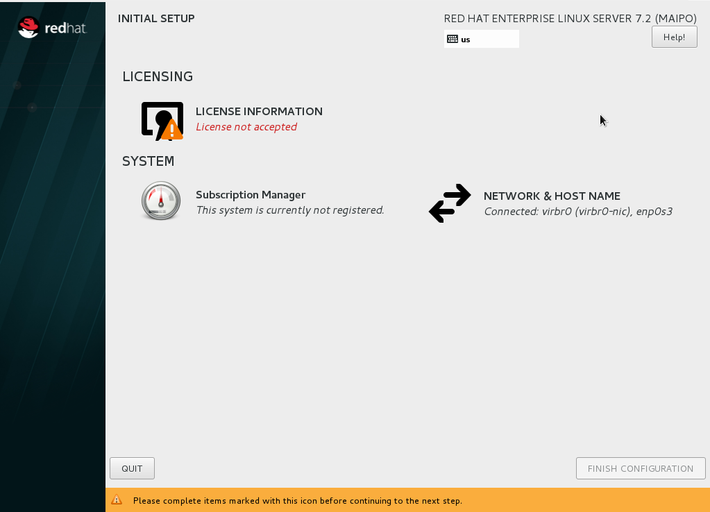
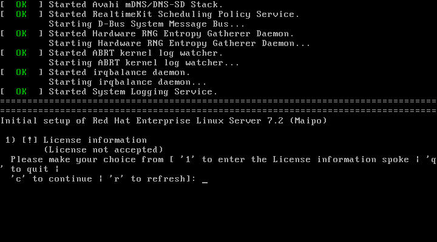
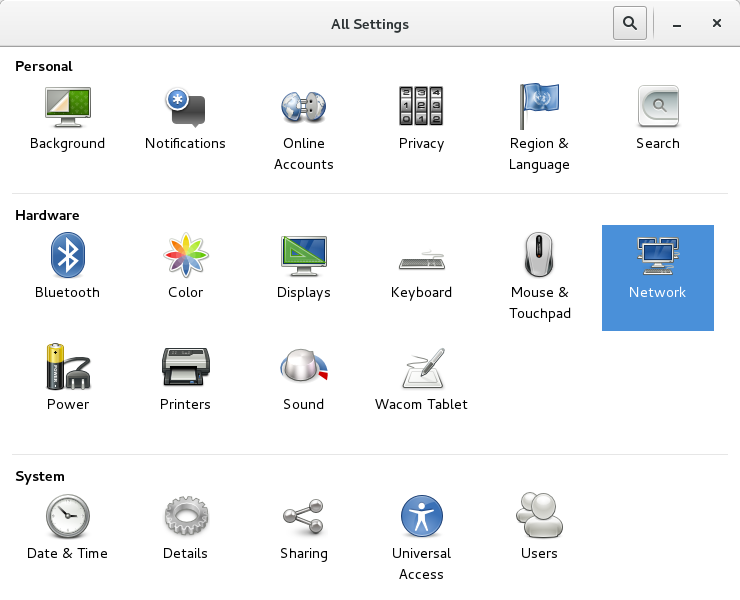
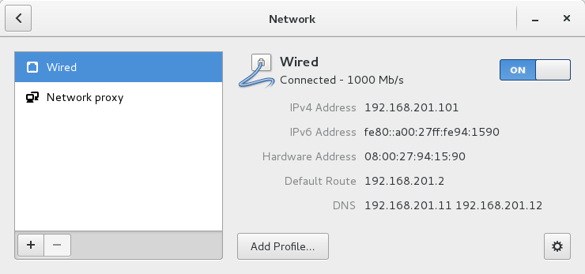
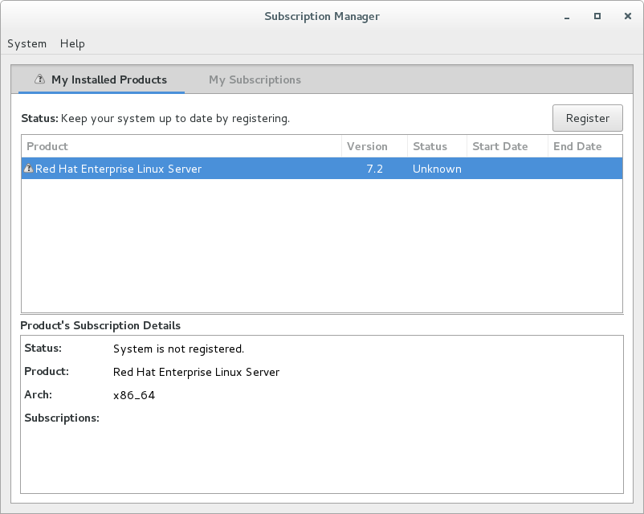
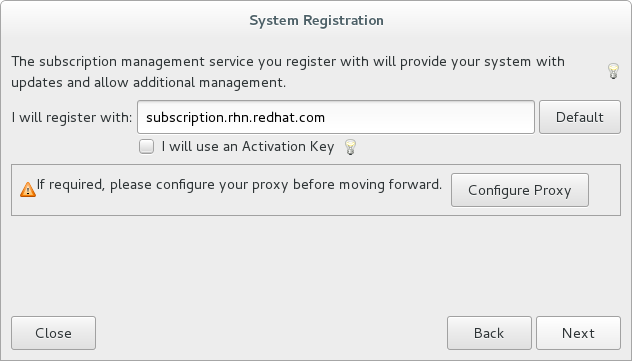
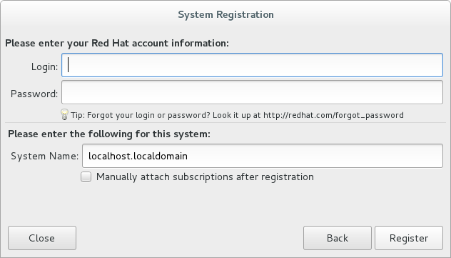
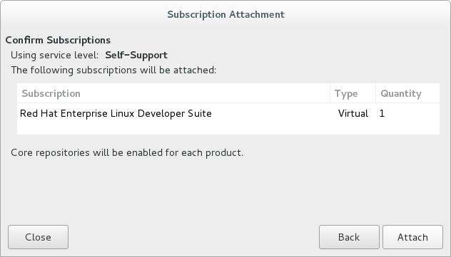
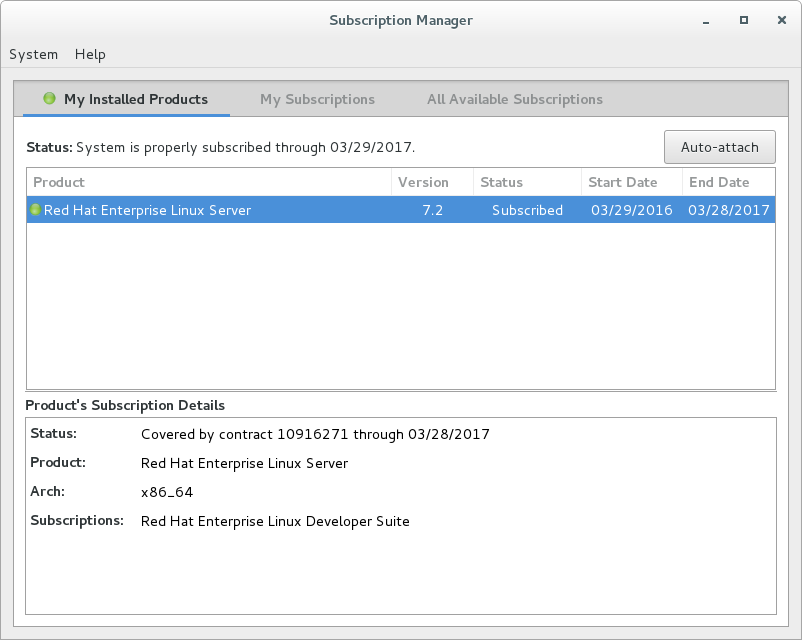

# Temporary work around for RHEL post-install license acceptance.

In some cases, when booting the system for the first time, you may not see the graphical post-installation  screen shown above. If you see a text-based license acceptance prompt as shown below, follow these alternate instructions:

. To accept the license agreement:
.. Enter _1_ and hit return to enter the _License information_ section.
.. Enter _2_ and hit return to accept the license agreement.
.. Enter _c_ and hit return to leave the _License information_ section.
.. Enter _c_ and hit return to complete the inital setup.
. Log in to the system with the username and password you created during installation at the graphical login screen. If you didn't create a regular user, you will need to log in as root and create a user. See <<troubleshooting,Troubleshooting and FAQ>>.
.. Select your preferred language for the GNOME desktop. Then click _Next_.
.. Select your keyboard layout. Then click _Next_.
.. Optionally follow the dialogs to connect your online accounts or click _Skip_.
.. Click _Start using Red Hat Enterprise Linux_.
. Check that the network connection has been started:
.. Run _Settings_ from the _System Tools_ group of the _Applications_ menu.
.. Click the _Network_ icon under the _Hardware group_ of _All Settings_.
+

+
.. Select the _Wired_ network.
.. Make sure the toggle switch in the upper right is switched on.
.. Check that the settings for IP address, default route, and DNS are appropriate for your network. If you need to change them, Click the settings button in the lower right corner.
.. When you are finished with network settings close the window by clicking the _X_ in the upper right corner.
+

+
. Now register the system:
.. Start _Red Hat Subscription Manager_ from the _System tools_ group of the _Applications_ menu.
.. Click the _Register_ button in the upper right corner of _Subscription Manager_.
+

+
.. Leave _I will register with_ set to the default on the _System Registratin_ dialog.
.. if you need to configure an HTTP proxy server, click _Configure Proxy_
.. Click _Next_ to move the next dialog.
+

+
.. Enter your Red Hat username and password. This is the same login that you use the Red Hat Customer Portal, https://access.redhat.com/[access.redhat.com, window='_blank'].
.. Optionally, enter a _System Name_ that will be used to identify this system on the Red Hat Customer Portal.
.. Click _Register_.
+

+
.. On the next dialog, you will be shown the list of subscriptions that are available to for your Red Hat username. If you have more than one subscription available, select the subscription to attach this system to.
+

+
.. Click _Attach_.
.. Click the _X_ in the upper right hand corner to close _Red Hat Subscription Manager_.
+

Return to the <<Install the latest updates>>.

